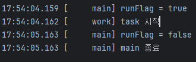

### 예제 

MyTask 는 내부 변수 runFlag 가 false 가 될때까지 계속 while 문을 실행하는 역할

MyTask 를 스레드로 실행시키고, 1초뒤 runFlag 를 false 를 시키면

MyTask 는 반복문에서 빠져나오는 것을 예상한다
```java
    public static void main(String[] args) {
        MyTask task = new MyTask();
        Thread t = new Thread(task, "work");
        log("runFlag = " + task.runFlag); // true
        
        t.start();
        sleep(1000);
        task.runFlag = false;
        
        log("runFlag = " + task.runFlag);
        log("main 종료");
    }

    // runFlag 가 false가 될떄까지 종료되지 않는 테스크
    static class MyTask implements Runnable {
        boolean runFlag = true;
        //volatile boolean runFlag = true;

        @Override
        public void run() {
            log("task 시작");
            while (runFlag) {}
            log("task 종료");
        }
    }

```

하지만 결과는 다음과 같이 main만 종료되고, task 종료는 표시되지 않는다 



### 원인 

runFlag 는 메인 메모리의 힙영역에 저장되어 있다.

CPU 입장에서 runFlag 를 매번 읽는 것보다, CPU 코어에 더 가까운 캐시 메모리에 저장한 후,

해당 값을 읽는게 효율적이다 

<br>


CPU는 코어 단위로 캐시 메모리를 가지고 있기 때문에, runflag 값을 변경해도 task 가 종료되지 않는 것이다

Main 스레드 > CPU 코어 1 > 캐시 메모리1 - (runflag) 

MyTask 스레드 > CPU 코어 2 > 캐시 메모리2 - (runflag)

<br>

### 해결 

각 코어에서 캐시 메모리가 아닌, 메인 메모리의 값을 읽어야 한다면 , 

runflag 에 volatile 을 키워드를 사용한다 

```java
volatile boolean runFlag = true;
```