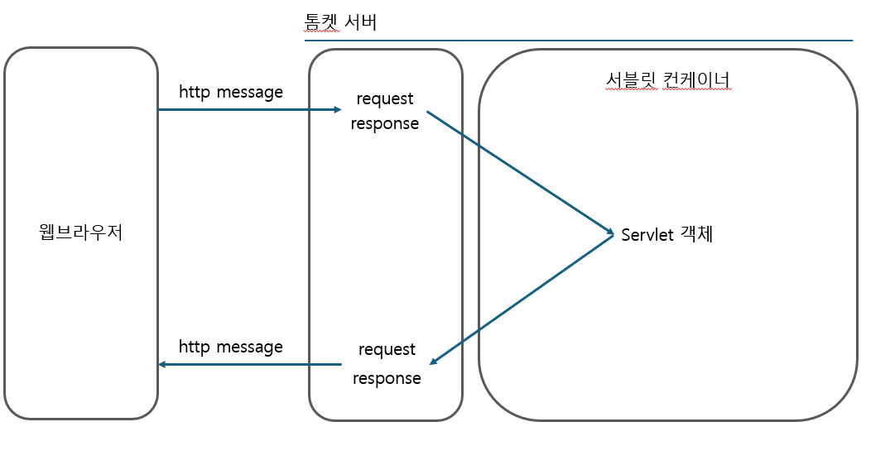

## MVC 


### 서블릿 컨테이너
[웹 애플리케이션 서버의 구조]



- HTTP 요청 메시지를 기반으로 웹서버에서 request 객체를 생성한다.
- 서블릿에서 로직을 처리하고, response 객체에 응답 정보를 추가한다.
- response 객체 청보로 HTTP 응답을 생성해서 내보낸다.

<br>


## Spring MVC 프레임워크 만들기

### 스프링이 프론트 컨트롤러를 쓰는 이유

### [1단계] FrontControllerServletV1
```java
protected void service(HttpServletRequest request, HttpServletResponse response)
		throws ServletException, IOException {		

		String requestURI = request.getRequestURI();
		// 컨트롤러(핸들러) 조회
		ControllerV1 controller = controllerMap.get(requestURI);

		if (controller == null) {
			response.setStatus(HttpServletResponse.SC_NOT_FOUND);
			return;
		}
		// 컨트롤러 로직 실행
		controller.process(request, response);
	}

```
프론트 컨트롤러에서 요청 URI 를 확인하고,
controller.process(request, response) 를 호출하는데, void 를 반환한다.
<br> <br>
MemberSaveController의 process() 내부 마지막 부분을 보면
```java
String viewPath = "/WEB-INF/views/save-result.jsp";
RequestDispatcher dispatcher = request.getRequestDispatcher(viewPath);
dispatcher.forward(request, response);
```
**컨트롤러(핸들러)가 로직처리, view 이동 처리를 모두 맡게되는 것을 볼 수 있고, 중복되는 코드가 많아진다.**

<br>

### [2단계] View 역할 분리

V2 에서는 컨트롤러의(핸들러) view 처리를 외부로 꺼낸다. <br>
컨트롤러(핸들러) 가 아닌, 프론트 컨트롤러에서 View 처리를 하는 것이다.

```java
MyView process(HttpServletRequest request, HttpServletResponse response)
throws ServletException, IOException;
```

회원 저장을 담당하는 컨트롤러는 회원 저장이 완료되면 MyView 객체를 반환한다.
```java
public MyView process(HttpServletRequest request, HttpServletResponse response) throws ServletException, IOException {
	
    String username = request.getParameter("username");
    int age = Integer.parseInt(request.getParameter("age"));
 
    Member member = new Member(username, age);
    memberRepository.save(member);
    request.setAttribute("member", member);
 
    return new MyView("/WEB-INF/views/save-result.jsp");
 }
```

MyView 코드
- dispatcher 를 통해 해당 view 로 이동한다.
```java
public class MyView {
    private String viewPath;
 
 public MyView(String viewPath) {
    this.viewPath = viewPath;
 }
 
 public void render(HttpServletRequest request, HttpServletResponse response) throws ServletException, IOException {
    RequestDispatcher dispatcher = request.getRequestDispatcher(viewPath);
    dispatcher.forward(request, response);
 }
}
```

그럼 프론트 컨트롤러는 컨트롤러(핸들러)들에게 process() 로 일을 시키고, <br>
MyView 를 받아 render()를 통해 view 로 이동만 하면된다.

```java
MyView view = controller.process(request, response);
view.render(request, response);
```

<br>

### [3단계] Model을 통한 데이터 전달

프론트 컨트롤러가 컨트롤러(핸들러)들을 호출할 때, 인자로 서블릿에서 제공하는 객체인  request, response를 전달하고 있다.
필요한 데이터만 받아 처리하도록 서블릿 종속성을 제거하자
```java
MyView process(HttpServletRequest request, HttpServletResponse response)
```
또한 View 의 이름도 위치가 중복되어 표시되는 것을 볼 수 있다.
```java
new MyView("/WEB-INF/views/save-result.jsp");
```

View 이름 문제와, 서블릿 종속성을 제거하기 위해 ModelView를 만든다.
```java
public class ModelView {
    private String viewName;
    private Map<String, Object> model = new HashMap<>();
	
    public ModelView(String viewName) {
        this.viewName = viewName;
    }
	
    public String getViewName() {
        return viewName;
    }
	
    public void setViewName(String viewName) {
        this.viewName = viewName;
    }
	
    public Map<String, Object> getModel() {
        return model;
    }
	
	public void setModel(Map<String, Object> model) {
        this.model = model;
    }
}
```

컨트롤러의 변화
```java
public interface ControllerV3 {
    ModelView process(Map<String, String> paramMap);
}
```
1. 요청으로 들어오는 데이터는 Map으로 받는다.

2. 컨트롤러는 결과 처리 후 view이름과 응답할 데이터가 있는 ModelView를 반환하고,
프론트 컨트롤러가 이를 처리한다.

<br>

회원 저장을 담당하는 컨트롤러가 다음과 같이 변경되었다.

```java
public class MemberSaveControllerV3 implements ControllerV3 {
    private MemberRepository memberRepository = MemberRepository.getInstance();
	
    @Override	
    public ModelView process(Map<String, String> paramMap) {
        String username = paramMap.get("username");
        int age = Integer.parseInt(paramMap.get("age"));
		
        Member member = new Member(username, age);
        memberRepository.save(member);
		
        ModelView mv = new ModelView("save-result");
        mv.getModel().put("member", member);
        return mv;
    }
}
```
<br>

그럼 이 프론트 컨트롤러는 ModelView 를 받게되고, 프론트 컨트롤러는 이전에 만든 MyView를 통해 처리한다.
```java
// FrontControllerServletV3
    ...(생략) ...
    
    Map<String, String> paramMap = createParamMap(request);

    ModelView mv = controller.process(paramMap);
	
    String viewName = mv.getViewName();
    MyView view = viewResolver(viewName);
	
    view.render(mv.getModel(), request, response);

```


```java
private MyView viewResolver(String viewName) {
    return new MyView("/WEB-INF/views/" + viewName + ".jsp");
 }
```
이후 MyView의 render를 통해 view로 이동한다.

<br>

### [4단계] Model, ViewResolver 의 등장
3단계의 컨트롤러(핸들러)들은 필요한 데이터만 map으로 받고, ModelView 를 만들어 반환하였다.
데이터를 처리하는 것 까지는 좋지만, ModelView를 만들어 보내는 것이 약간은 번거롭다.

```java
public interface ControllerV4 {
	String process(Map<String, String> paramMap, Map<String, Object> model);
}
```

```java
public class MemberSaveControllerV4 implements ControllerV4 {
    private MemberRepository memberRepository = MemberRepository.getInstance();
	
    @Override
    public String process(Map<String, String> paramMap, Map<String, Object> model) {
        String username = paramMap.get("username");
        int age = Integer.parseInt(paramMap.get("age"));
	
        Member member = new Member(username, age);
        memberRepository.save(member);
	
        model.put("member", member);
        return "save-result";
 }
}
```

model을 파라미터로 받아, ModelView 에 Model을 넣어줄 필요도 없다.
그리고 view만 프론트컨트롤러가 받아 처리해주면 된다.

```java

//FrontControllerServletV4
... 생략 
    
    String viewName = controller.process(paramMap, model);

    MyView view = viewResolver(viewName);
    view.render(model, request, response);

```

### [5단계] 다양한 컨트롤러의 지원 - 어탭터 패턴

컨트롤러V3 는 ModelView를 반환하고, 파라미터를 Map으로 받는다.
컨트롤러V4 는 View 이름만 반환하고, 파라미터와 Model 을 인자로 받는다.

```java
public interface ControllerV3 {
    ModelView process(Map<String, String> paramMap);
}
```
```java
public interface ControllerV4 {
    String process(Map<String, String> paramMap, Map<String, Object> model);
}
```

지금까지 만든 프론트 컨트롤러는 요청이 들어오면 아래처럼
요청 URI에 따라 V4 컨트롤러만 사용 가능하다.
```java
    private Map<String, ControllerV4> controllerMap = new HashMap<>();
    ... 생략

    @Override
    protected void service(HttpServletRequest request, HttpServletResponse response)
	    String requestURI = request.getRequestURI();
	    ControllerV4 controller = controllerMap.get(requestURI);
        
            ...(생략)
	}
```

컨트롤러V3,V4 를 모두 사용하도록 어탭터 패턴을 도입한다.

```java
public interface MyHandlerAdapter {
    boolean supports(Object handler);
	
    ModelView handle(HttpServletRequest request, HttpServletResponse response, Object handler) throws ServletException, IOException;
}
```

- Object handler 는 컨트롤러가 들어온다.
- supports() 는 해당 어탭터가 컨트롤러를 처리할 수 있는지 물어본다.
- handle() 은 무조건 ModelView를 반환한다. 컨트롤러 V4처럼 String 만 반환한다면,
직접 ModelView 만들도록 해야한다.

<br>

```java
public class ControllerV3HandlerAdapter implements MyHandlerAdapter {
    @Override
    public boolean supports(Object handler) {
        return (handler instanceof ControllerV3);
        // V3 컨트롤러면 처리할 수 있으니 TRUE 를 반환한다.
    }
	
    @Override
    public ModelView handle(HttpServletRequest request, HttpServletResponse response, Object handler) {
		
        //supports 를 통해 검증했기 때문에 컨트롤러 V3로 변환한다.
        ControllerV3 controller = (ControllerV3) handler;
        Map<String, String> paramMap = createParamMap(request);
		
        //컨트롤러 처리가 끝나고 ModelView를 반환한다.
        ModelView mv = controller.process(paramMap);
        return mv;
    }
	
    private Map<String, String> createParamMap(HttpServletRequest request) {
        Map<String, String> paramMap = new HashMap<>();
		
        request.getParameterNames().asIterator()
                        .forEachRemaining(paramName -> paramMap.put(paramName, request.getParameter(paramName)));
        return paramMap;
    }
}

```
<br>

String 만 반환하는 V4도 다르지 않다. handle 부분만 보자
```java
 @Override
 public ModelView handle(HttpServletRequest request, HttpServletResponse response, Object handler) {
 
    ControllerV4 controller = (ControllerV4) handler;
    Map<String, String> paramMap = createParamMap(request);
    Map<String, Object> model = new HashMap<>();
	
    String viewName = controller.process(paramMap, model);

    ModelView mv = new ModelView(viewName);
    mv.setModel(model);

    return mv;
 }
```
String 을 받아 어댑터에서 직접 ModelView 를 만들어 프로트 컨트롤러에게 전달한다.

### 프론트 컨트롤러 전체 코드

```java
@WebServlet(name = "frontControllerServletV5", urlPatterns = "/front-controller/v5/*")
public class FrontControllerServletV5 extends HttpServlet {
	private final Map<String, Object> handlerMappingMap = new HashMap<>();
	private final List<MyHandlerAdapter> handlerAdapters = new ArrayList<>();

	public FrontControllerServletV5() {
		initHandlerMappingMap();
		initHandlerAdapters();
	}

	private void initHandlerMappingMap() {
		handlerMappingMap.put("/front-controller/v5/v3/members/new-form", new MemberFormControllerV3());
		handlerMappingMap.put("/front-controller/v5/v3/members/save", new MemberSaveControllerV3());
		handlerMappingMap.put("/front-controller/v5/v3/members", new MemberListControllerV3());

		// 다른 버전 핸들러 추가
		handlerMappingMap.put("/front-controller/v5/v4/members/new-form", new MemberFormControllerV4());
		handlerMappingMap.put("/front-controller/v5/v4/members/save", new MemberSaveControllerV4());
		handlerMappingMap.put("/front-controller/v5/v4/members", new MemberListControllerV4());
	}

	private void initHandlerAdapters() {
		handlerAdapters.add(new ControllerV3HandlerAdapter());
		handlerAdapters.add(new ControllerV4HandlerAdapter()); // v4를 처리하는 어탭터도 추가
	}

	@Override
	protected void service(HttpServletRequest request, HttpServletResponse response) throws ServletException, IOException {
		Object handler = getHandler(request);
		if (handler == null) {
			response.setStatus(HttpServletResponse.SC_NOT_FOUND);
			return;
		}
		MyHandlerAdapter adapter = getHandlerAdapter(handler);
		ModelView mv = adapter.handle(request, response, handler);
		MyView view = viewResolver(mv.getViewName());
		view.render(mv.getModel(), request, response);
	}

	private Object getHandler(HttpServletRequest request) {
		String requestURI = request.getRequestURI();
		return handlerMappingMap.get(requestURI);
	}

	private MyHandlerAdapter getHandlerAdapter(Object handler) {
		for (MyHandlerAdapter adapter : handlerAdapters) {
			if (adapter.supports(handler)) {
				return adapter;
			}
		}
		throw new IllegalArgumentException("handler adapter를 찾을 수 없습니다. handler = " + handler);
	}

	private MyView viewResolver(String viewName) {
		return new MyView("/WEB-INF/views/" + viewName + ".jsp");
	}
}

```

스프링 프레임워크처럼 어떤 컨트롤러든 받아 처리할 수 있게 되었다.

애노테이션이 붙은 컨트롤러, 특정 클래스를 상속받는 컨트롤러 어떤 것이든 상관없다.


[참고]
[인프런 백엔드 웹 개발 핵심 기술](https://www.inflearn.com/course/lecture?courseSlug=%EC%8A%A4%ED%94%84%EB%A7%81-mvc-1&unitId=71233)