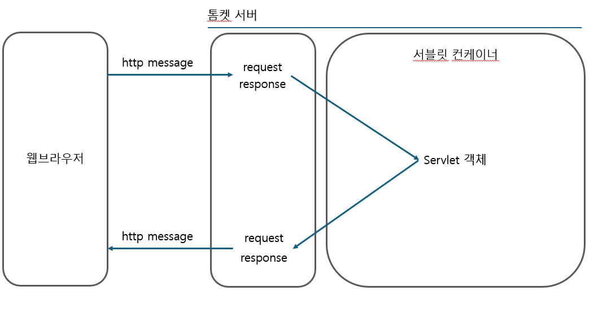

## MVC 


### 서블릿 컨테이너
[웹 애플리케이션 서버의 구조]



- HTTP 요청 메시지를 기반으로 웹서버에서 request 객체를 생성한다.
- 서블릿에서 로직을 처리하고, response 객체에 응답 정보를 추가한다.
- response 객체 청보로 HTTP 응답을 생성해서 내보낸다.

<br>


### 스프링이 프론트 컨트롤러를 쓰는 이유

[1단계]
FrontControllerServletV1
```java
protected void service(HttpServletRequest request, HttpServletResponse response)
		throws ServletException, IOException {		

		String requestURI = request.getRequestURI();
		ControllerV1 controller = controllerMap.get(requestURI);

		if (controller == null) {
			response.setStatus(HttpServletResponse.SC_NOT_FOUND);
			return;
		}
		controller.process(request, response);
	}

```
프론트 컨트롤러에서 요청 URI 를 확인하고,
controller.process(request, response) 를 호출하는데, void 를 반환한다.
<br> <br>
**즉 컨트롤러(핸들러)가 로직처리, view 이동 처리를 모두 맡게되고, 중복되는 코드가 많아진다.**

