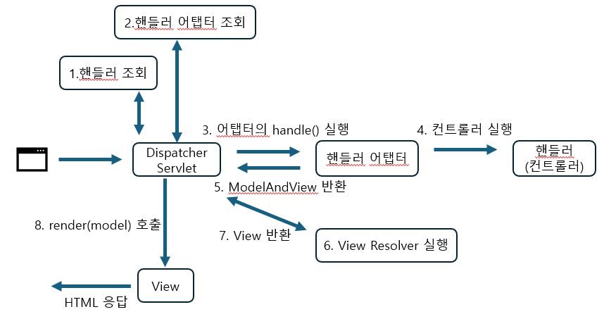
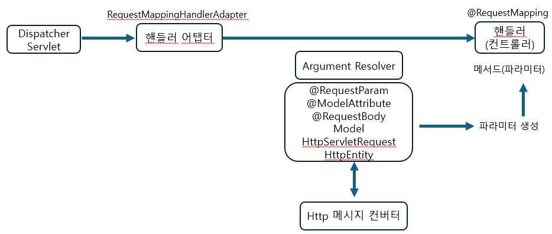
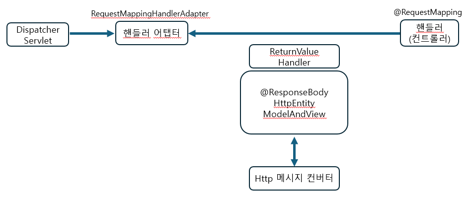

### 스프링 MVC 구조 
스프링에서 HttpServletRequest , Model 타입 그리고 @RequestParam , @ModelAttribute 와 같은
애노테이션, @RequestBody , HttpEntity 로 응답 처리
 

이렇게 요청,응답 방식을 유연하게 처리할 수 있었던 이유는 ArgumentResolver 덕분이다.
 
먼저 기본적인 MVC 구조는 다음과 같다. 

### MVC 구조

앞서말한 @RequestParam, Model 등 다양한 파라미터를 사용할 수 있었던 것은 
핸들러 어댑터에서 시작된다.

자세히 말하면 애노테이션 기반 컨트롤러를 처리하는 RequestMappingHandlerAdapter 에서 시작된다고 볼 수 있다.

### RequestMappingHandlerAdapter 실행 과정 (요청)

- RequestMappingHandlerAdapter 가 개발자가 만든 컨트롤러의 메서드를 호출할 것이다.
- 그전에 Argument Resolver가 실행되며, HTTP 메시지 컨버터를 사용하여, @RequestParam, Model 과 같은
파라미터를 처리한다.
- 이후 컨트롤러(핸들러)의 메서드를 실행하게 된다.

응답도 아래처럼 유사하다.

### RequestMappingHandlerAdapter 실행 과정 (응답)

- ReturnValueHandler 에서 HTTP 메시지 컨버터를 통해 @ResponseBody, HttpEntity 와 같은 타입을 보고 적절한 값을 어댑터에게 넘겨준다.
- 그럼 어탭터는 그 값을 보고 ModelAndView인지, @ResponseBody로 온것인지, HttpEntity 인지를 보고 적절한 처리를 한다. String 이면 적절한 View 를 찾아 렌더링한다.
- 컨트롤러에서 String으로 뷰 이름을 반환해도, 동작하는 이유가 바로 ReturnValueHandler 덕분이다