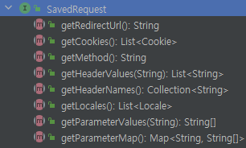

## 인증 프로세스

### - 폼인증

- HTTP 기반의 폼 로그인 인증 메커니즘을 사용하는 API
- UsernamePasswordAuthenticationFilter 가 생성되어 폼 인증 처리를 담당한다.


### UsernamePasswordAuthenticationFilter

- 로그인 시 사용되는 

로그인 요청 시, 로직 흐름
1. AbstractAuthenticationProcessingFilter 에서 Matcher를 통해 로그인 요청인지 판단
2. 로그인 요청이면 attemptAuthentication 메서드로 인증 시작 
3. 전달받은 id,pw 로 UsernamePasswordAuthenticationToken 생성
4. AuthenticationManager.authenticate() 로 인증 처리 시작
5. 인증 성공 시, Authentication(UsernamePasswordAuthenticationToken) 에 UserDetail,권한이 담겨 반환
6. SessionAuthenticationStrategy 세션 관련 작업 수행
7. Authentication을 SecurityContext 에 저장하고, SecurityContextHolder를 통해 Context를 세션에 저장
8. RememberMeServices.loginSuccess 호출 (선택)
9. ApplicationEventPublisher.publishEvent() 인증 성공 이벤트 게시
10. AuthenticationSuccessHandler 호출 


<br>

### RememberMe 인증

- 로그인 시, 인증 정보를 기억하는 기능

### RememberMeServices 

- 기억하기 인증을 위한 토큰을 생성한다
- TokenBasedRememberMeServices : 해싱을 사용하여 쿠키 기반 토큰을 만들기 위해 사용
- PersistentTokenBasedRememberMeServices : 생성한 토큰을 DB와 같은 매체에 저장할 때 사용


rememberMe() API
```java

```


### RememberMeAuthenticationFilter 

1. RememberMeAuthenticationFilter 에서 Authentication 있는지 판단
2. 없으면 리멤버미 쿠기 전달해서 RemeberMeServices.authlogin() 실행 
3. 해당 쿠키로 사용자 정보 가져와서 RememberMeAuthenticationToken 생성
4. 해당 토큰으로 AuthenticationManger 를 통해 인증 처리 시작
5. 성공 시, Authentication 을 SecurityConext에 저장하고, Context를 세션에 저장 


### RequestCache - SavedRequest 

- 인증되지 않아 로그인 페이지로 리다이렉트되고, 로그인 뒤 이전에 요청 했던 정보를 SavedRequest 객체에 담고,
- 쿠키 or 세션에 저장하고 필요 시 다시 가져와 실행하는 캐시 형태의 구조



- SavedRequest 는 위와 같은 정보를 담고 있다

### 프로세스 

[인증 받지 않은 상태로 /test 에 접근]
1. HttpSessionRequestCache 가 DefaultSavedRequest 생성해서 세션에 저장 
2. 로그인 페이지로 이동
3. 로그인 인증 성공, 
4. AuthenticationSuccessHandler 에서 세션에 있는 DefaultSavedRequest 를 사용하여, 이전에 요청했던 url("/test") 을 가져온다
5. 해당 url 로 리다이렉트 
6. 어떤 요청이든 작동하는 RequestCacheAwareFilter 에서 SavedRequest 가 있는지, SavedRequest 의 url이랑 현재 요청url이랑 같은지 확인
7. 같으면 SavedRequest 사용 , 아니면 그냥 현재 request를 다음 필터로 넘긴다 

### RequestCacheAwareFilter

- RequestCacheAwareFilter 는 캐시에 꺼낼 때, 특정 파라미터 값이 일치하는지를 보고 SavedRequest를 가져오는데 ,
- 기본 파라미터 값은 continue 이다.

```java
HttpSessionRequestCache requestCache = new HttpSessionRequestCache();
requestCache.setMatchingRequestParameterName("param1=y");
```

- 다음과 같이 캐시에서 꺼낼 때 사용되는 파라미터를 변경할 수 있다.

```java
SavedRequest savedRequest = requestCache.getRequest(request, response);
String targetUrl = savedRequest.getRedirectUrl(); // continue 또는 설정한 파라미터 (param1=y) 가 붙어서 나옴
```

- 그래서 로그인 성공하고, 캐시에서 getRedirectUrl() 로 url을 가져오면 자동으로 파라미터를 붙여서 다음에 요청할 URL을 준다 
- (캐시를 사용하기 위해 )

<br>

> 또한 아래와 같이, /test/test?continue 또는  /test/test?param1=y 파라미터를 안붙이고
> 
> 그냥 /test/test 를 보냈을 때 테스트 결과, RequestCacheAwareFilter 에서 SavedRequest를 사용하지는 않지만, 로그인에는 지장이 없는 것으로 보인다.
>

```java

@Override
public void onAuthenticationSuccess(HttpServletRequest request, HttpServletResponse response,
    Authentication authentication) throws IOException, ServletException {
			SavedRequest savedRequest = requestCache.getRequest(request, response);
			// String targetUrl = savedRequest.getRedirectUrl(); // continue 또는 위에서 설정한 파라미터  param1=y 가 붙어서 나옴
			// System.out.println("캐시에 저장된 URL "+ targetUrl); 
			String url = "/test/test";  // 이렇게 파라미터를 안붙이고 보내도 상관은 없다
			response.sendRedirect(url);
	}


```