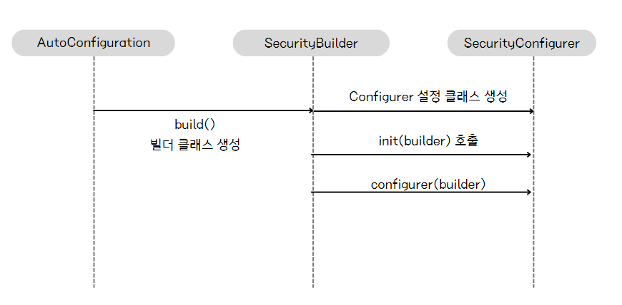
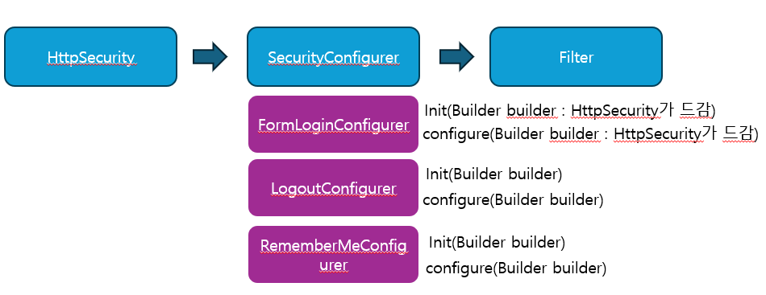
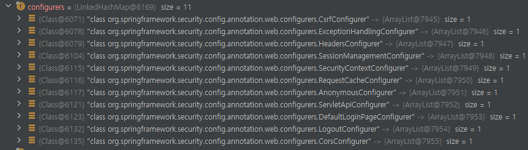

### 프로젝트 환경
- spring boot 3.2.8
- Open JDK 17

gradle 사용하는 경우, 다음과 같이 의존성을 추가할 수 있다

```declarative
implementation 'org.springframework.boot:spring-boot-starter-security'
implementation 'org.springframework.boot:spring-boot-starter-web'
```

--------------------------
### 초기화 작업
위의 시큐리티 라이브러리를 추가하면, 별도의 설정없이 기본적인 웹 보안 기능이 작동된다.

[웹 보안 기능]
- 기본적으로 모든 요청에 대해 인증 여부를 검사하고, 인증이 되어야 자원 접근이 가능하도록 한다
- 인증(로그인) 방식 2가지 제공  >>>  Form, httpBasic 2가지 제공
- 인증을 할 수 있는 로그인 페이지가 제공된다
- 인증 승인을 위한 기본 계정이 제공된다
  - SecurityProperties 클래스에서 미리 설정됨 
  - (username : user, password : 랜덤문자열 )


---

### 보안 설정 클래스

기본적인 보안 설정은 어디에서 설정을 해주는걸까?

SpringBootWebSecurityConfiguration 가 바로 기본 보안을 설정하는 클래스를 생성하는 클래스이다.


__그럼 SpringBootWebSecurityConfiguration 내부를 보자__

```java
import org.springframework.boot.autoconfigure.security.ConditionalOnDefaultWebSecurity;

@ConditionalOnDefaultWebSecurity
static class SecurityFilterChainConfiguration {
	@Bean
	@Order(SecurityProperties.BASIC_AUTH_ORDER)
	SecurityFilterChain defaultSecurityFilterChain(HttpSecurity http) throws Exception {
		http.authorizeHttpRequests((requests) -> requests.anyRequest().authenticated()); // 어떠한 요청이라도 인증을 받아야 한다
		http.formLogin(withDefaults()); // form 인증 방식을 제공 
		http.httpBasic(withDefaults()); // http basic 인증 방식 제공
		return http.build();
	}
}

```
- HttpSecurity를 주입받아 보안을 설정을 하고, SecurityFilterChain 를 반환하는 것을 볼 수 있다

- SecurityFilterChain 이 바로 기본 보안 설정 클래스이며 해당 클래스에 어떤 보안 기능이 작동해야하는지 다양한 필터들로 구성되어 있다.
  - **그리고 해당 필터들로 인해 기본적인 보안 기능이 연계되어 작동하는 것이다**

-------------------------
<br>

<details>
  <summary> 부록 : SecurityFilterChainConfiguration에 적용된 @ConditionalOnDefaultWebSecurity는 뭘까</summary>

@ConditionalOnDefaultWebSecurity 은 해당 메서드가 실행되기 위한 조건이다.

#### @ConditionalOnDefaultWebSecurity
```java
@Target({ ElementType.TYPE, ElementType.METHOD })
@Retention(RetentionPolicy.RUNTIME)
@Documented
@Conditional(DefaultWebSecurityCondition.class)
public @interface ConditionalOnDefaultWebSecurity {

}
```
- DefaultWebSecurityCondition 클래스가 조건으로 걸려있다

#### DefaultWebSecurityCondition
```java
class DefaultWebSecurityCondition extends AllNestedConditions {

	DefaultWebSecurityCondition() {
		super(ConfigurationPhase.REGISTER_BEAN);
	}

	@ConditionalOnClass({ SecurityFilterChain.class, HttpSecurity.class })
	static class Classes {

	}

	@ConditionalOnMissingBean({ SecurityFilterChain.class })
	static class Beans {

	}

}
```
- ConditionalOnClass, ConditionalOnMissingBean 이 있는데, 이 2개의 조건이 참이어야 최종적으로 기본 보안이 작동
- ConditionalOnClass 는 설정된 클래스들이 클래스 경로에 존재하면 true (시큐리티 의존성을 추가하면 모두 추가된다)
- ConditionalOnMissingBean 는 설정된 클래스를 직접 생성하지 않았다면 true 가 반환된다
- 모두 참이면 위에서 언급한 defaultSecurityFilterChain 메서드를 실행할 수 있다


</details>


---------------------------
<br>

### 초기화 작업을 하는 SecurityBuilder 와 SecurityConfigurer

앱 실행 시, 인증,인가 초기화 관련 설정을 하는 인터페이스는 SecurityBuilder 와 SecurityConfigurer 가 있다.

- SecurityBuilder 는 웹 보안을 구성하는 클래스를 생성하며, 구현체로 WebSecurity, HttpSecurity, AuthenticationManagerBuilder 가 존재
- SecurityConfigurer 는 HTTP 요청에 관한 보안처리를 담당하는 필터를 생성하고, 초기화 설정을 돕는다 (구현체는 SecurityContextConfigurer, FormLoginConfigurer, CsrfConfigurer 등)
  - 시큐리티는 필터 기반의 보안 프레임워크이므로 필터는 중요하다 

[정리]
- SecurityBuilder(HttpSecurity) 가 (SecurityConfigurer)SecurityConfigurer 를 참조하며(사용하며)
SecurityConfigurer 를 통해 인증/인가 초기화 작업을 진행한다고 볼 수 있다**

<br>

그럼 앞서 말한 과정들을 정리하며, SecurityBuilder 와 SecurityConfigurer 를 정리해본다


- 자동 설정(AutoConfiguration)에 의해 Builder 를 생성한다
- 빌더는 설정 클래스인 Configurer 를 생성한다
- 이후 Configurer 의 init, configurer 메서드를 호출 하여, 초기화 작업을 수행한다  (필터 생성 등)


<br>

-----------------------------
실제 시큐리티의 Configurer 와 Filter 의 종류는 여러개가 있다


- SecurityBuilder(HttpSecurity) -> SecurityConfigurer의 init,configure 메서드를 통해 인증/인가에 관련된 초기화 작업 진행할 때, 여러 필터들이 생성된다
- 보안 기능을 처리하는 필터들이 생성되면 작업이 끝난다 
- 필터의 종류는 CorsFilter, CsrfFilter, LogoutFilter, SecurityContextHolderFilter 등이 있다


<br>

### 초기화 과정을 디버깅 해보자

### HttpSecurityConfiguration class 부터 시작 
주석 번호 참조 

```java
// HttpSecurityConfiguration class
@Bean(HTTPSECURITY_BEAN_NAME)
@Scope("prototype")
HttpSecurity httpSecurity() throws Exception{
        LazyPasswordEncoder passwordEncoder=new LazyPasswordEncoder(this.context);
        AuthenticationManagerBuilder authenticationBuilder=new DefaultPasswordEncoderAuthenticationManagerBuilder(
        this.objectPostProcessor,passwordEncoder);
        authenticationBuilder.parentAuthenticationManager(authenticationManager());
        authenticationBuilder.authenticationEventPublisher(getAuthenticationEventPublisher());
        HttpSecurity http=new HttpSecurity(this.objectPostProcessor,authenticationBuilder,createSharedObjects());
        WebAsyncManagerIntegrationFilter webAsyncManagerIntegrationFilter=new WebAsyncManagerIntegrationFilter();
        webAsyncManagerIntegrationFilter.setSecurityContextHolderStrategy(this.securityContextHolderStrategy);
        // @formatter:off
        http // 여기 각 메서드 내부에서 필요한 Configurer 들을 생성한다 
            .csrf(withDefaults()) // 1. HttpSecurity 의 csrf 설정 진행
            .addFilter(webAsyncManagerIntegrationFilter)
            .exceptionHandling(withDefaults()) // 2. exceptionHandling 설정 진행
            .headers(withDefaults())
            .sessionManagement(withDefaults())
            .securityContext(withDefaults())
            .requestCache(withDefaults())
            .anonymous(withDefaults())
            .servletApi(withDefaults())
            .apply(new DefaultLoginPageConfigurer<>());
        http.logout(withDefaults());
        // @formatter:on
        applyCorsIfAvailable(http);
        applyDefaultConfigurers(http);
        return http;
        }

```

csrf 메서드만 예시로 보면 CsrfConfigurer 를 생성하는 것을 볼 수 있다
```java
public HttpSecurity csrf(Customizer<CsrfConfigurer<HttpSecurity>>csrfCustomizer)throws Exception{
        ApplicationContext context=getContext();
        csrfCustomizer.customize(getOrApply(new CsrfConfigurer<>(context)));
        // new CsrfConfigurer 클래스를 생성해서 어딘가에 적용(Apply)하고 있다
        return HttpSecurity.this;
}

```
- CsrfConfigurer는 SecurityConfigurer 를 상속받는다 
- Configurer 설정 클래스를 생성해서 초기화 준비 작업을 진행한다는 것이 중요하다

<br>

```java
public HttpSecurity exceptionHandling(
            Customizer<ExceptionHandlingConfigurer<HttpSecurity>> exceptionHandlingCustomizer) throws Exception {
        exceptionHandlingCustomizer.customize(getOrApply(new ExceptionHandlingConfigurer<>()));
        return HttpSecurity.this;
}
```

- exceptionHandling 도 동일하게 Configurer 를 생성
- HttpSecurityConfiguration 의 httpSecurity() 에서 이러한 작업을 10개 정도하면서, 인증 및 인가 작업을 진행한다
- **그리고 HttpSecurity 를 반환해서 빈을 생성한다** 

### 그럼 해당 HttpSecurity 빈을 주입받아 초기화 작업을 진행되는 곳이 있는데, 바로

SecurityFilterChainConfiguration 의 defaultSecurityFilterChain 메서드 인자에 주입받아 사용되는 것이다 
- HttpSecurity 에는 여러개의 Configurer를 가지고 있다 

### SpringBootWebSecurityConfiguration class
```java
@Configuration(proxyBeanMethods = false)
@ConditionalOnDefaultWebSecurity
static class SecurityFilterChainConfiguration {

   @Bean
   @Order(SecurityProperties.BASIC_AUTH_ORDER)
   SecurityFilterChain defaultSecurityFilterChain(HttpSecurity http) throws Exception {
      http.authorizeHttpRequests((requests) -> requests.anyRequest().authenticated());
      http.formLogin(withDefaults()); // 여기서도 설정 클래스 생성
      http.httpBasic(withDefaults()); // 여기에서도 설정 클래스 생성 
      return http.build(); // build 에서 설정 클래스의 init, configure 메서드를 통해 초기화 진행 
   }

}
```
- 인증 및 인가 기초 작업을 마친 HttpSecurity 가 들어오고
- 그리고 formLogin, httpBasic 등 추가 작업을 진행하는데, 여기서도 관련 Configurer 들이 생성될 것이다.




- 내부에 configurers 클래스가 생성되어 있는 것을 볼 수 있다.
- 그리고 http.build()에서 각 configurer 마다 init, configure 메서드를 호출하여 초기화를 본격적으로 진행한다

> init 은 초기화 작업을 하고,  <br>
> configure는 말그대로 설정을 하는데, 주로 보안 필터를 생성하여 셋팅하는 작업을 한다 <br>
> configurer(설정클래스) 를 커스텀하게 직접 만들어 필터를 설정할 수 도 있다. (뒷장에서)

<br>

----------------------------------

<br>

## HttpSecurity 
- 결국 HttpSecurityConfiguration 에서 HttpSecurity(SecurityBuilder) 를 만들고 초기화를 진행한다
- SecurityFilterChainConfiguration 에서 HttpSecurity를 받아 다시 추가적인 초기화를 하고,
- HttpSecurity의 build() 를 사용해서, SecurityFilterChain 빈을 생성하는 것이 최종 목표
- **결론 : HttpSecurity 는 SecurityFilterChain 를 만든다.**

> Configurer 내부에서 init, configure 메서드를 통해 초기화 작업을 진행하면
각종 필터들이 만들어지게 되는데, 필터들은 SecurityFilterChain 빈안의 리스트에 저장된다.
SecurityFilterChain 는 인증/인가에 필요한 필터들을 가지고 있는 필터 체인이다.


## SecurityFilterChain 
- 여러 필터들을 가지고 관리하는 클래스 
- boolean matches(request), List<Filter> getFilter() 메서드를 가지고 있다
- mathes() 는 현재 요청이 현재 SecurityFilterChain 을 사용해서 처리해야 하는지 판단하는 메서드
- getFilter() 는 어떤 필터들이 현재 필터체인에 포함되어 있는지 알 수 있다


- Matcher를 통해 적절한 SecurityFilterChain 을 찾고, 필터를 적용한다

---------------------

<br>

## WebSecurity [WebSecurity > HttpSecurity]
- HttpSecurity가 HttpSecurityConfiguration 에서 생성된 것처럼 
- WebSecurityConfiguration(설정클래스) 에서 WebSecurity 를 생성하고 초기화를 진행한다
- WebSecurity는 HttpSecurity가 만든 SecurityFilterChain 빈을 SecurityBuilder 에 다시 저장하고,
- WebSecurity가 WebSecurity.build()를 호출하면 SecurityBuilder에서 SecurityFilterChain 을 꺼내서 FilterChainProxy 생성자에 전달하는 역할을 수행 
- WebSecurity는 FilterChainProxy 를 만든다  (SecurityFilterChain 을 가지는 FilterChainProxy 생성)

> 결국 FilterChainProxy 가 필터체인을 들고 있으니, 필터들을 실행시키는 첫 단추라고 볼 수 있다 

> WebSecurity는  HttpSecurity 가 만든 여러개의 SecurityFilterChain 을 가질 수 있다. (다중 보안 설정)


### 돌아와서 SecurityFilterChain , FilterChainProxy
- 요청이 오면 SecurityFilterChain 에 있는 필터들이 실행되는데, 사실 SecurityFilterChain 이 직접 수행하지 않고, 다른 클래스에게 위임한다
- 바로 FilterChainProxy 가 먼저 요청을 받은 후, 필터들로 보안 처리 진행 
- 초기화 과정은 FilterChainProxy 생성하는 것이 최종 목표이고 FilterChainProxy 이 모든 필터를 가지고 있다

-----------------------------------------------------------------------------

<br>
HttpScurity -> SecurityFilterChain 생성

WebSecurity -> FilterChainProxy 생성 (SecurityFilterChain를 포함)

-----------------------------------------------------------------------------

<br>

### Filter 그리고 DelegatingFilterProxy 의 역할 

사용자 요청이 오면 WAS에서 생성된 필터를 거쳐서 서블릿에서 처리하고,
다시 필터를 거쳐 응답을 한다

요청 >> 필터1 >> 필터2 >> 필터3... >> 서블릿 

응답 << 필터1 << 필터2 << 필터3... << 서블릿 

WAS는 스프링 영역이 아니기 때문에, 여기에 필터를 만든다면 스프링의 DI, AOP 등 기술을 사용할 수 없다.
그래서 DelegatingFilterProxy 라는 필터를 만들고, 해당 Proxy필터에서  (IOC 안의)FilterChainProxy 빈을 스프링
빈을 찾아 요청을 위임한다

그럼 필터인 동시에, 스프링의 기술을 사용할 수 있게 되는 것이다


client > Filter1 > **DelegatingFilterProxy** > Filter3 > Servlet 

- DelegatingFilterProxy 에서 FilterChainProxy 빈을 찾아 호출하여 위임한다 
- FilterChainProxy 는 적절한 SecurityFilterChain 을 선택하여 보안 처리 로직을 진행한다

<br>

-------

<br>

### 사용자 정의 API

HttpSecurity 에 제공하는 메서드로 사용자 정의 보안 설정을 할 수 있다.

```java
 @EnableWebSecurity
 @Configuration
public class SecurityConfig {

    // 스프링 시큐리티7 버전부터는 람다 형식만 지원 할 예정
    @Bean
    public SecurityFilterChain securityFilterChain(HttpSecurity http) throws Exception {
        http.authorizeHttpRequests(auth -> auth.anyRequest().authenticated())
                .formLogin(Customizer.withDefaults());
        return http.build(); // 자동 설정에 의한 SecurityFilterChain 은 생성되지 않는다.
    }
}

```

- @EnableWebSecurity 를 선언한다 
- 직접 httpSecurity의 build를 호출하면 자동 설정에 의한 기본 SecurityFilterChain 빈은 생성되지 않는다.

<br>

### 기본 계정 생성 방법

```yaml
spring:
  security:
   user:
     name:user
     password:1111
     roles:USER
```

```java
@Bean
public InMemoryUserDetailsManager inMemoryUserDetailsManager(){
	UserDetails user = User.withUsername("user")
		.password("{noop}111")
		.authorities("ROLE_USER")
		.build();
	return new InMemoryUserDetailsManager(user);
}
```

- 메모리상에서 계정을 생성하여 유지할 수 있다


