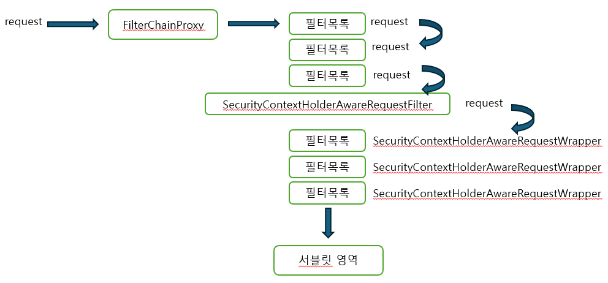
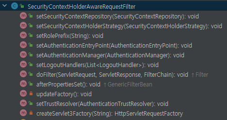
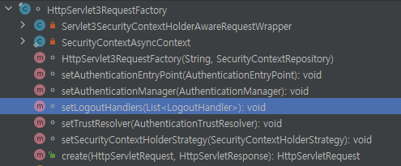
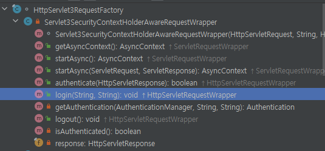

### 서블릿, MVC 로 인증 기능 확장

스프링 시큐리티는 일반적으로 필터 기반으로 보안 처리를 진행

- 스프링 시큐리티는 다양한 프레임워크 및 API와의 통합을 제공하며,
- 서블릿 또는 MVC 에서도 스프링(시큐리티) 기능을 확장해서 사용할 수 있다

 
 

### Servlet 3+ 통합
인증 관련 기능을 필터가 아닌, 서블릿 영역에서도 할 수 있게 해준다

1) SecurityContextHolderAwareRequestFilter
- HTTP 요청이 오면 HttpServletRequest에 보안 관련 메서드를 추가적으로 제공하는 래퍼 클래스를 적용한다. (SecurityContextAwareRequestWrapper)
- 해당 래퍼 클래스는 서블릿 영역까지 전달되어 서블릿 API의 보안 메소드를 사용하여 개발자가 인증, 로그인, 로그아웃 등의 작업을 수행할 수 있다

 

2) HttpServlet3RequestFactory
- Servlet 3API와의 통합을 제공하기 위해 Servlet3SecurityContextHolderAwareRequestWrapper 객체를 생성한다.
- Servlet3SecurityContextHolderAwareRequestWrapper 는 위의 SecurityContextAwareRequestWrapper 를 상속받은 구현체이다

 

3) Servlet3SecurityContextHolderAwareRequestWrapper
- HttpServletRequest의 래퍼 클래스로서 Servlet 3.0 의 기능을 지원하면서 동시에 SecurityContextHolder 와의 통합을 제공한다.
- 즉 (SecurityContextHolder)인증 관련 기능들을 제공하여 통합한다  
- 이 래퍼를 사용하여 SecurityContext에 쉽게 접근할 수 있고, Servlet 3.0의 비동기 처리와 같은 기능을 사용하는 동안 보안 컨텍스트를 관리할 수 있다

 

### 객체 구조 및 생성 과정 

### SecurityContextHolderAwareRequestFilter

SecurityContextHolderAwareRequestFilter 는 authenticationManager, logoutHandler, ContextRepository 등

즉 해당 필터가 인증,유지,로그아웃 등에 필요한 객체를 모두 가지고 있다 

그리고 HttpServlet3RequestFactory 를 생성하는데, 그냥 생성하는 것이 아니라

위와 같이 HttpServlet3RequestFactory 는 set 메서드를 가지고 있으며, 

생성할 때, set 메서드를 통해 인증에 필요한 객체를 전달받고 있다. (authenticationManager, logoutHandler 등등)

그리고 HttpServlet3RequestFactory 는 Servlet3SecurityContextHolderAwareRequestWrapper 를 생성한다

 

Servlet3SecurityContextHolderAwareRequestWrapper 는 기존 request 객체를 래핑하고 있으며 ,

그리고 logout(), login() 등 인증 관련 메서드를 제공하고 있다.
래핑 객체가 서블릿 또는 MVC 에서 사용될 수 있는 객체이다 

- 래핑 클래스의 login을 호출하면 HttpServlet3RequestFactory 가 가지고 있는 AuthenticationManager 를 통해 인증 처리 
- 래핑 클래스의 logout을 호출하면 HttpServlet3RequestFactory 가 가지고 있는 LogoutHandler 를 통해 로그아웃 처리 

