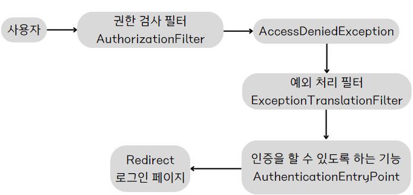
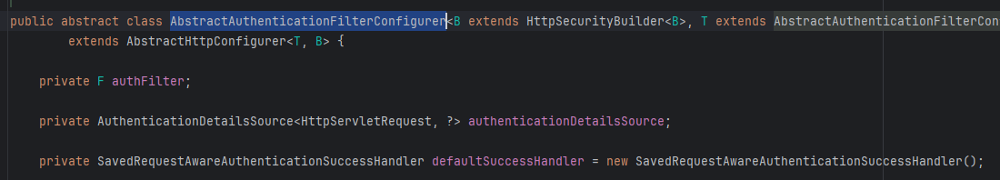
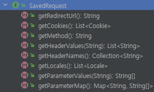

## 인증 프로세스

### - 폼인증

- HTTP 기반의 폼 로그인 인증 메커니즘을 활성화하는 API 를 제공
- 스프링 시큐리티가 제공하는 로그인 페이지를 사용하여, 사용자 이름, 비밀번호가 포함된 로그인 페이지를 제공
- 사용자가 form을 통해 사용자 이름, 비밀번호를 제공하면 스프링 시큐리티는 HttpServletRequest에서 이값을 읽어 처리한다
- UsernamePasswordAuthenticationFilter 가 생성되어 폼 인증 처리를 담당한다.

### 폼 인증 흐름도


1. 적절한 권한이 있는지 AuthorizationFilter 에서 검사하고, 권한이 없으면 예외발생
2. ExceptionTranslationFilter 에서 캐치하고
3. AuthenticationEntryPoint 를 통해 인증을 받을 수 있도록 로그인 페이지로 리다이렉트 

### formLogin() API 사용법

```JAVA
HttpSecurity.formLogin ( httpSecurityFormLoginConfigurer->httpSecurityFormLoginConfigurer
        .loginPage("/loginPage")
        .loginProcessingUrl("/loginProc") // 이름,비밀번호를 검증할 URL (Form 태그의 action에 해당) 
        .defaultSuccessUrl("/",[alwaysUse]) // 로그인 이후 이동할 페이지 (alwaysUse 가 true이면 무조건 해당 URL로 이동, 디폴트는 false)
        .failureUrl("/failed") // 인증 실패 시 이동할 url
        .usernameParameter("username") 
        .passwordParameter("password")
        .failureHandler(AuthenticationFailureHandler)
        .successHandler(AuthenticationSuccessHandler)
        .permitAll() // permitAll을 하면 내부적으로 failureUrl(), loginPage(), loginProcessingUrl() 에 대한 URL에 사용자 접근을 허용함 -> 누구나 접근이 가능해야하기 때문

 );
```


### formLogin 내부 설정 과정


```java
public HttpSecurity formLogin(Customizer<FormLoginConfigurer<HttpSecurity>> formLoginCustomizer) throws Exception {
	formLoginCustomizer.customize(getOrApply(new FormLoginConfigurer<>()));
	return HttpSecurity.this;
}
```
- form 인증에 설정을 커스텀할 수 있도록 인자를 받고 있으며
- 커스텀 과정에서 FormLoginConfigurer 를 생성한다
- FormLoginConfigurer 생성자를 보자

<br>

```java
public FormLoginConfigurer() {
	super(new UsernamePasswordAuthenticationFilter(), null);
	usernameParameter("username");
	passwordParameter("password");
}
```
- 사용자 이름과 비밀번호는 username, password 로 받고 있으며
- 부모에게 UsernamePasswordAuthenticationFilter 를 전달하고 있다.
- UsernamePasswordAuthenticationFilter 는 인증을 담당하는 필터 
- FormLoginConfigurer 는 AbstractAuthenticationFilterConfigurer를 상속받고 있다
- AbstractAuthenticationFilterConfigurer 내부를 살펴보자

<br>

AbstractAuthenticationFilterConfigurer

- 성공 처리 핸들러인 defaultSuccessHandler 가 무엇인지도 볼 수 있고

```java
// AbstractAuthenticationFilterConfigurer
protected AbstractAuthenticationFilterConfigurer() {
	setLoginPage("/login");
}
```
- 기본 로그인 페이지도 볼 수 있다.
- 이러한 값들은 제공되는 API로 모두 변경이 가능하다 

```JAVA
@Override
public void init(B http) throws Exception {
	updateAuthenticationDefaults();
	updateAccessDefaults(http);
	registerDefaultAuthenticationEntryPoint(http);
}

protected final void updateAuthenticationDefaults() {
    if (this.loginProcessingUrl == null) {
        loginProcessingUrl(this.loginPage);
    }
    if (this.failureHandler == null) {
        failureUrl(this.loginPage + "?error");
    }
    LogoutConfigurer<B> logoutConfigurer = getBuilder().getConfigurer(LogoutConfigurer.class);
    if (logoutConfigurer != null && !logoutConfigurer.isCustomLogoutSuccess()) {
        logoutConfigurer.logoutSuccessUrl(this.loginPage + "?logout");
    }
}

```
- 메서드 내부를 하나씩 보면 loginProcessingUrl, failureUrl 등을 설정하는 것을 알 수 있다

<br>

```JAVA
	@Override
	public void configure(B http) throws Exception {
		PortMapper portMapper = http.getSharedObject(PortMapper.class);
		if (portMapper != null) {
			this.authenticationEntryPoint.setPortMapper(portMapper);
		}
		RequestCache requestCache = http.getSharedObject(RequestCache.class);
		if (requestCache != null) {
			this.defaultSuccessHandler.setRequestCache(requestCache);
		}
		this.authFilter.setAuthenticationManager(http.getSharedObject(AuthenticationManager.class));
		this.authFilter.setAuthenticationSuccessHandler(this.successHandler); // 인증 성공 핸들러 
		this.authFilter.setAuthenticationFailureHandler(this.failureHandler); // 인증 실패 핸들러
		if (this.authenticationDetailsSource != null) {
			this.authFilter.setAuthenticationDetailsSource(this.authenticationDetailsSource);
		}
		SessionAuthenticationStrategy sessionAuthenticationStrategy = http
			.getSharedObject(SessionAuthenticationStrategy.class); // 세션 전략 
		if (sessionAuthenticationStrategy != null) {
			this.authFilter.setSessionAuthenticationStrategy(sessionAuthenticationStrategy);
		}
		RememberMeServices rememberMeServices = http.getSharedObject(RememberMeServices.class);
		if (rememberMeServices != null) {
			this.authFilter.setRememberMeServices(rememberMeServices);
		}
		SecurityContextConfigurer securityContextConfigurer = http.getConfigurer(SecurityContextConfigurer.class);
		if (securityContextConfigurer != null && securityContextConfigurer.isRequireExplicitSave()) {
			SecurityContextRepository securityContextRepository = securityContextConfigurer
				.getSecurityContextRepository();
			this.authFilter.setSecurityContextRepository(securityContextRepository);
		}
		this.authFilter.setSecurityContextHolderStrategy(getSecurityContextHolderStrategy());
		F filter = postProcess(this.authFilter);
		http.addFilter(filter);
	}
```
- configure 에서 인증,인가 관련 핵심 클래스를 생성하고 공유할 수 있도록 설정한다 
- 인증 성공,실패 처리를 하기위한 핸들러 설정, 세션 전략, RememberMe 설정 등을 하고 있는 것을 볼 수 있다
- 마지막 작업으로는 http 에 필터를 추가하고 있다
- 자세한 내용은 필터 장에서 설명

<br>

------

<br>

### UsernamePasswordAuthenticationFilter

- 스프링 시큐리티는 인증을 AbstractAuthenticationProcessingFilter 를 기본적으로 사용한다
- UsernamePasswordAuthenticationFilter 는 AbstractAuthenticationProcessingFilter 를 상속 받아 attemptAuthentication() 메소드를 새로 오버라이드 한다
- CustomAuthenticationFilter 를 만든다면 AbstractAuthenticationProcessingFilter 를 상속받아 attemptAuthentication() 를 구현해야한다
- 참고로 인증 프로세스가 초기화될 때 로그인, 로그아웃 페이지 생성을 담당하는 DefaultLoginPageGeneratingFilter 와 DefaultLogoutPageGeneratingFilter 도 생성되어 초기화 된다

UsernamePasswordAuthenticationFilter 흐름도
1. 사용자가 **Get /login** 요청 
2. **AbstractAuthenticationProcessingFilter** 에서 RequestMatcher를 통해 로그인 요청인지 판단 -> 아니면 chain.doFilter 로 다음 필터로 넘어감
3. 로그인 요청이면 attemptAuthentication() 메서드로 인증 시작 
4. 전달받은 username,password 로 **UsernamePasswordAuthenticationToken** 생성
5. **AuthenticationManager**.authenticate(Token) 로 인증 처리 시작
6. 인증 성공 시, Authentication(UsernamePasswordAuthenticationToken) 에 UserDetail, Authorities (권한)이 저장되어 반환된다
   - 인증 실패 시, 다음 순서로 호출된다
   - SecurityContextHolder >  SecurityContext가 삭제된다 : 악의적인 시도일 수도 있으니 그냥 제거해버리는 듯 
   - RememberMeServices > RememberMeServices.loginFail 이호출된다
   - AuthenticationFailureHandler > 인증 실패 핸들러를 호출한다
7. SessionAuthenticationStrategy : 새로운 로그인을 알리고, 세션 관련 작업 수행 
8. SecurityContextHolder > Authentication을 SecurityContext 에 저장하고, SecurityContextHolder를 통해 SecurityContext를 세션에 저장
9. RememberMeServices.loginSuccess 호출 (선택 - Remember-Me 가 설정된 경우에)
10. ApplicationEventPublisher.publishEvent() 인증 성공 이벤트 게시
11. AuthenticationSuccessHandler 호출 


<br>

### RememberMe 인증

- 로그인 시, 인증 정보를 기억하는 기능

### RememberMeServices 

- 기억하기 인증을 위한 토큰을 생성한다
- TokenBasedRememberMeServices : 해싱을 사용하여 쿠키 기반 토큰을 만들기 위해 사용
- PersistentTokenBasedRememberMeServices : 생성한 토큰을 DB와 같은 매체에 저장할 때 사용


rememberMe() API
```java

```


### RememberMeAuthenticationFilter 

1. RememberMeAuthenticationFilter 에서 Authentication 있는지 판단
2. 없으면 리멤버미 쿠기 전달해서 RemeberMeServices.authlogin() 실행 
3. 해당 쿠키로 사용자 정보 가져와서 RememberMeAuthenticationToken 생성
4. 해당 토큰으로 AuthenticationManger 를 통해 인증 처리 시작
5. 성공 시, Authentication 을 SecurityConext에 저장하고, Context를 세션에 저장 


### RequestCache - SavedRequest 

- 인증되지 않아 로그인 페이지로 리다이렉트되고, 로그인 뒤 이전에 요청 했던 정보를 SavedRequest 객체에 담고,
- 쿠키 or 세션에 저장하고 필요 시 다시 가져와 실행하는 캐시 형태의 구조



- SavedRequest 는 위와 같은 정보를 담고 있다

### 프로세스 

[인증 받지 않은 상태로 /test 에 접근]
1. HttpSessionRequestCache 가 DefaultSavedRequest 생성해서 세션에 저장 
2. 로그인 페이지로 이동
3. 로그인 인증 성공, 
4. AuthenticationSuccessHandler 에서 세션에 있는 DefaultSavedRequest 를 사용하여, 이전에 요청했던 url("/test") 을 가져온다
5. 해당 url 로 리다이렉트 
6. 어떤 요청이든 작동하는 RequestCacheAwareFilter 에서 SavedRequest 가 있는지, SavedRequest 의 url이랑 현재 요청url이랑 같은지 확인
7. 같으면 SavedRequest 사용 , 아니면 그냥 현재 request를 다음 필터로 넘긴다 

### RequestCacheAwareFilter

- RequestCacheAwareFilter 는 캐시에 꺼낼 때, 특정 파라미터 값이 일치하는지를 보고 SavedRequest를 가져오는데 ,
- 기본 파라미터 값은 continue 이다.

```java
HttpSessionRequestCache requestCache = new HttpSessionRequestCache();
requestCache.setMatchingRequestParameterName("param1=y");
```

- 다음과 같이 캐시에서 꺼낼 때 사용되는 파라미터를 변경할 수 있다.

```java
SavedRequest savedRequest = requestCache.getRequest(request, response);
String targetUrl = savedRequest.getRedirectUrl(); // continue 또는 설정한 파라미터 (param1=y) 가 붙어서 나옴
```

- 그래서 로그인 성공하고, 캐시에서 getRedirectUrl() 로 url을 가져오면 자동으로 파라미터를 붙여서 다음에 요청할 URL을 준다 
- (캐시를 사용하기 위해 )

<br>

> 또한 아래와 같이, /test/test?continue 또는  /test/test?param1=y 파라미터를 안붙이고
> 
> 그냥 /test/test 를 보냈을 때 테스트 결과, RequestCacheAwareFilter 에서 SavedRequest를 사용하지는 않지만, 로그인에는 지장이 없는 것으로 보인다.
>

```java

@Override
public void onAuthenticationSuccess(HttpServletRequest request, HttpServletResponse response,
    Authentication authentication) throws IOException, ServletException {
			SavedRequest savedRequest = requestCache.getRequest(request, response);
			// String targetUrl = savedRequest.getRedirectUrl(); // continue 또는 위에서 설정한 파라미터  param1=y 가 붙어서 나옴
			// System.out.println("캐시에 저장된 URL "+ targetUrl); 
			String url = "/test/test";  // 이렇게 파라미터를 안붙이고 보내도 상관은 없다
			response.sendRedirect(url);
	}


```