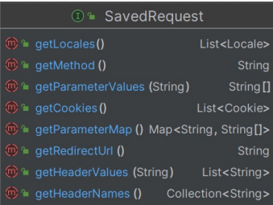

### RequestCache
- 인증 절차 문제로 리다이렉트 된 후, 이전 요청 정보를 담고 있는 'SavedRequest’ 객체를 쿠키 혹은 세션에 저장하고 필요시 다시 가져와 실행하는 캐시 메카니즘이다
- 구현체로 HttpSessionRequestCache 가 제공된다


### SavedRequest
- 이전 요청에 대한 정보가 담겨있다
- 해당 객체의 URL을 사용하여, 인증 후 이전에 이동하려 했던 페이지로 이동한다 
- 구현체로 DefaultSavedRequest 가 제공된다



<br>
<br>

### ExceptionTranslationFilter

- 인증,인가 예외 발생 시, 예외를 처리하는 필터 

```java
protected void sendStartAuthentication(HttpServletRequest request, HttpServletResponse response, FilterChain chain,
    AuthenticationException reason) throws ServletException, IOException {
	// SEC-112: Clear the SecurityContextHolder's Authentication, as the
    // existing Authentication is no longer considered valid
    SecurityContext context = this.securityContextHolderStrategy.createEmptyContext();
	this.securityContextHolderStrategy.setContext(context);
	this.requestCache.saveRequest(request, response);
	this.authenticationEntryPoint.commence(request, response, reason);
}
```
- 권한이 없는 url 요청 시, 위처럼 requestCache 를 통해 이전 요청 정보를 저장한다

<br>

```java
	@Override
	public void saveRequest(HttpServletRequest request, HttpServletResponse response) {
    ... 생략
		if (this.createSessionAllowed || request.getSession(false) != null) {
			// Store the HTTP request itself. Used by
			// AbstractAuthenticationProcessingFilter
			// for redirection after successful authentication (SEC-29)
			DefaultSavedRequest savedRequest = new DefaultSavedRequest(request, this.portResolver,
					this.matchingRequestParameterName);
			request.getSession().setAttribute(this.sessionAttrName, savedRequest);
			if (this.logger.isDebugEnabled()) {
				this.logger.debug(LogMessage.format("Saved request %s to session", savedRequest.getRedirectUrl()));
			}
		}
		else {
			this.logger.trace("Did not save request since there's no session and createSessionAllowed is false");
		}
	}
```

- DefaultSavedRequest 생성하여 세션에 저장하는 것을 볼 수 있다.
- 이후 login 페이지로 이동하게 된다 
- 그리고 인증을 다시 성공하면 SuccessHandler 에서 SavedRequest 를 사용한다 

<br>

#### SavedRequestAwareAuthenticationSuccessHandler

```java
	@Override
	public void onAuthenticationSuccess(HttpServletRequest request, HttpServletResponse response,
			Authentication authentication) throws ServletException, IOException {
		SavedRequest savedRequest = this.requestCache.getRequest(request, response);
		if (savedRequest == null) {
			super.onAuthenticationSuccess(request, response, authentication);
			return;
		}
		String targetUrlParameter = getTargetUrlParameter();
		if (isAlwaysUseDefaultTargetUrl()
				|| (targetUrlParameter != null && StringUtils.hasText(request.getParameter(targetUrlParameter)))) {
			this.requestCache.removeRequest(request, response);
			super.onAuthenticationSuccess(request, response, authentication);
			return;
		}
		clearAuthenticationAttributes(request);
		// Use the DefaultSavedRequest URL
		String targetUrl = savedRequest.getRedirectUrl();
		getRedirectStrategy().sendRedirect(request, response, targetUrl);
	}
```

- 세션에 있는 DefaultSavedRequest 를 가져온다 
- targetUrlParameter 은 이정에 저장했던 이동하려는 url 이고 파라미터는 기본값으로 "continue" 가 붙는다 
- 예를들어 로그인하지 않고 인증이 필요한 http:user 로 이동하려다 실패하고, 로그인 페이지로 이동
- 다시 로그인에 성공하면 http:user?continue 로 리다이렉트 된다고 볼 수 있다
- SavedRequest 를 이용하여 이전 url로 이동 시, continue 가 붙는 이유는 아래에서 확인한다 


<br>
<br>

### RequestCacheAwareFilter
- 리다이렉트 된 후, 여러 필터를 거치면서 RequestCacheAwareFilter 도 실행된다

```java
@Override
public void doFilter(ServletRequest request, ServletResponse response, FilterChain chain)
    throws IOException, ServletException {
	HttpServletRequest wrappedSavedRequest = this.requestCache.getMatchingRequest((HttpServletRequest) request,
    (HttpServletResponse) response);
	chain.doFilter((wrappedSavedRequest != null) ? wrappedSavedRequest : request, response);
}
```
- getMatchingRequest() 을 통해 세션에 있는 SavedRequest 와 현재 요청 Request 가 동일한지 검사한다 
- 이때 continue 가 있다면, SavedRequest 와 현재 요청 Request 의 내부 값이 같은지 모두 검사하고, continue 가 없다면 내부 값을 검사하지 않고 그냥 다음 필터로 진행한다
- 최종적으로 SavedRequest 와 현재 요청 Request 가 같다면  SavedRequest 를 사용하여 다음 필터로 진행 


