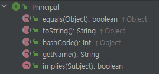
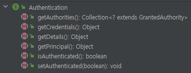

## 인증 아키텍처

- 인증 정보 Authentication
- 보안 컨텍스트 SecurityContext, SecurityContextHolder
- 인증 관리자 AuthenticationManager : 관리만 하는 역할
- 인증 제공자 AuthenticationProvider : 인증 처리를 한다
- 사용자 상세 서비스 UserDetailsService
- 사용자 상세 UserDetails : 해당 타입으로 시큐리티에서 유저로 사용한다


### 인증 프로세스

1. 요청을 받아 DelegatingFilterProxy 에서 스프링 컨테이너로 요청 전달
2. FilterChainProxy (스프링 빈) 에서 인증 필터 진행
3. 여러 필터 진행 
4. 앞에 여러 필터를 거쳐, AuthenticationFilter 도착 
5. AuthenticationFilter 에서 Authentication 객체 생성 
6. AuthenticationManager 에 Authentication 전달
7. <strong>AuthenticationManager 가 AuthenticationProvider 에게 위임</strong>
8. AuthenticationProvider -> UserDeailsService 로 UserDetails 가져옴
9. UserDetails의 비밀번호가 요청온 비밀번호와 맞는지 비교 (PasswordEncoder 사용)
10. 성공하면 Authentication 반환 
11. Authentication 을 SecurityContext 에 저장,(SecurityContextHolder를 사용하여)

### Authentication (스프링)

- 사용자 인증 정보를 저장하는 객체, 인증 이후 SecurityContext 에 저장되어 어플리케이션 전역으로 사용 가능
- Principal (자바 API) 을 상속 받고 있다. 
- Principal 은 인증 주체 , 인증 요청 전에는 사용자 아이디, 인증 후에는 UserDetails 를 저장하는 용도로 사용 





getPrincipal() : 인증 주체를 의미하며 인증 요청의 경우 사용자 이름, 인증 후 UserDetails 타입 객체로 사용

getCredentials() : 인증 주체가 올바른 것을 나타내는 자격 증명으로 비밀번호 저장 (보통 사용 안함)

getAuthorities() : 권한

getDetails() : 세부 사항, IP주소, 인증서 일련 번호 등

isAuthenticated() : 인증 상태 반환

setAuthenticated(boolean) : 인증 상태 설정

<br>


-------------------------------------------------------

[인증전] Authentication

- principal : username
- cridentials : password
- authorities : 
- authenticated : false

[인증 후] Authentication

- principal : UserDetails
- cridentials : 
- authorities : ROLE_USER (GrantedAuthority 타입의 컬렉션)
- authenticated : true

AuthenticationFilter 에서 인증 완료된 Authentication 을 Context에 저장한다.


-------------------------------------

### 인증 진행 과정

AbstractAuthenticationProcessingFilter
```java
// AbstractAuthenticationProcessingFilter
	private void doFilter(HttpServletRequest request, HttpServletResponse response, FilterChain chain)
			throws IOException, ServletException {
		if (!requiresAuthentication(request, response)) {
			chain.doFilter(request, response);
			return;
		}
		try {
			// 인증 시작
			Authentication authenticationResult = attemptAuthentication(request, response);
			if (authenticationResult == null) {
				// return immediately as subclass has indicated that it hasn't completed
				return;
			}
			this.sessionStrategy.onAuthentication(authenticationResult, request, response);
			// Authentication success
			if (this.continueChainBeforeSuccessfulAuthentication) {
				chain.doFilter(request, response);
			}
			successfulAuthentication(request, response, chain, authenticationResult);
		}
		catch (InternalAuthenticationServiceException failed) {
			this.logger.error("An internal error occurred while trying to authenticate the user.", failed);
			unsuccessfulAuthentication(request, response, failed);
		}
		catch (AuthenticationException ex) {
			// Authentication failed
			unsuccessfulAuthentication(request, response, ex);
		}
	}

```
- UsernamePasswordAuthenticationFilter 의 attemptAuthentication() 를 통해 인증을 시작한다 

UsernamePasswordAuthenticationFilter
```java
// UsernamePasswordAuthenticationFilter
	public Authentication attemptAuthentication(HttpServletRequest request, HttpServletResponse response)
			throws AuthenticationException {
		if (this.postOnly && !request.getMethod().equals("POST")) {
			throw new AuthenticationServiceException("Authentication method not supported: " + request.getMethod());
		}
		String username = obtainUsername(request);
		username = (username != null) ? username.trim() : "";
		String password = obtainPassword(request);
		password = (password != null) ? password : "";
		UsernamePasswordAuthenticationToken authRequest = UsernamePasswordAuthenticationToken.unauthenticated(username,
				password);
		// Allow subclasses to set the "details" property
		setDetails(request, authRequest);
		return this.getAuthenticationManager().authenticate(authRequest);
	}
```
- 인증 받기 전 상태인 UsernamePasswordAuthenticationToken 을 만든다
- Token 내부의 principal, credentials 속성은 전달받은 username, password 가 저장된다 
- 그리고 getAuthenticationManager() 을 통해 AuthenticationManager 에게 인증을 위임한다 


<br>

ProviderManager 
```java
//ProviderManager
	@Override
	public Authentication authenticate(Authentication authentication) throws AuthenticationException {
		Class<? extends Authentication> toTest = authentication.getClass();
		AuthenticationException lastException = null;
		AuthenticationException parentException = null;
		Authentication result = null;
		Authentication parentResult = null;
		int currentPosition = 0;
		int size = this.providers.size();
		for (AuthenticationProvider provider : getProviders()) {
			if (!provider.supports(toTest)) {
				continue;
			}
			if (logger.isTraceEnabled()) {
				logger.trace(LogMessage.format("Authenticating request with %s (%d/%d)",
						provider.getClass().getSimpleName(), ++currentPosition, size));
			}
			try {
				result = provider.authenticate(authentication);
				if (result != null) {
					copyDetails(authentication, result);
					break;
				}
			}
        ... 생략
```
- 적절한 AuthenticationProvider 를 찾아서 인증을 다시 위임한다 
- provider.authenticate(authentication) 를 통해 인증을 시작 
- 폼인증인 경우, DaoAuthenticationProvider 사용


DaoAuthenticationProvider
```java
// DaoAuthenticationProvider
	@Override
	protected final UserDetails retrieveUser(String username, UsernamePasswordAuthenticationToken authentication)
			throws AuthenticationException {
		prepareTimingAttackProtection();
		try {
			UserDetails loadedUser = this.getUserDetailsService().loadUserByUsername(username);
			if (loadedUser == null) {
				throw new InternalAuthenticationServiceException(
						"UserDetailsService returned null, which is an interface contract violation");
			}
			return loadedUser;
		}
		catch (...)
	}
```
- UserDetailsService 를 통해 시스템에 존재하는 사용자가 있는지 찾는다 

```java
	protected void additionalAuthenticationChecks(UserDetails userDetails,
			UsernamePasswordAuthenticationToken authentication) throws AuthenticationException {
		if (authentication.getCredentials() == null) {
			this.logger.debug("Failed to authenticate since no credentials provided");
			throw new BadCredentialsException(this.messages
				.getMessage("AbstractUserDetailsAuthenticationProvider.badCredentials", "Bad credentials"));
		}
		String presentedPassword = authentication.getCredentials().toString();
		if (!this.passwordEncoder.matches(presentedPassword, userDetails.getPassword())) {
			this.logger.debug("Failed to authenticate since password does not match stored value");
			throw new BadCredentialsException(this.messages
				.getMessage("AbstractUserDetailsAuthenticationProvider.badCredentials", "Bad credentials"));
		}
	}
```
- 이후 passwordEncoder 를 통해 패스워드가 맞는지 확인한다 (해당 함수는 추후 deprecation)

AbstractUserDetailsAuthenticationProvider
```java
// AbstractUserDetailsAuthenticationProvider
	protected Authentication createSuccessAuthentication(Object principal, Authentication authentication,
			UserDetails user) {
		// Ensure we return the original credentials the user supplied,
		// so subsequent attempts are successful even with encoded passwords.
		// Also ensure we return the original getDetails(), so that future
		// authentication events after cache expiry contain the details
		UsernamePasswordAuthenticationToken result = UsernamePasswordAuthenticationToken.authenticated(principal,
				authentication.getCredentials(), this.authoritiesMapper.mapAuthorities(user.getAuthorities()));
		result.setDetails(authentication.getDetails());
		this.logger.debug("Authenticated user");
		return result;
	}
```
- 최종적으로 인증된 UsernamePasswordAuthenticationToken 을 만들어 반환한다 
- 해당 인증 객체는 AbstractAuthenticationProcessingFilter 까지 전달된다 
- 이후 SecurityContext 내부에 인증 객체를 저장하고, SecurityContextHolder 에 Context를 저장하고, 세션에도 Context를 저장한다 


<br>

#### 디버깅해보면 좋은 클래스 

- AbstractAuthenticationProcessingFilter
- UsernamePasswordAuthenticationFilter - attemptAuthentication() 
    - 사용자 요청으로 토큰(UsernamePasswordAuthenticationToken)만들어 AuthenticationManager 에 전달 
- ProvierManager (AuthenticationManager 구현체)
- DaoAuthenticationProvider (AuthenticationProvider 구현체)