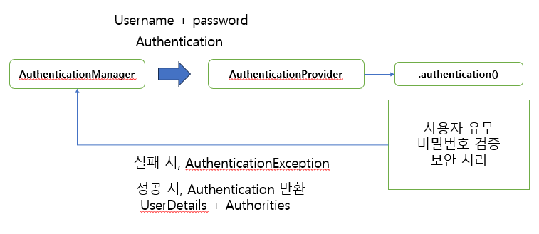
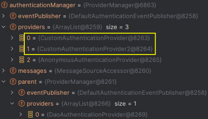
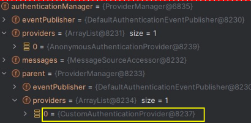
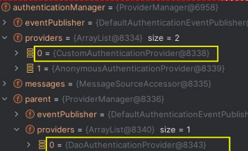
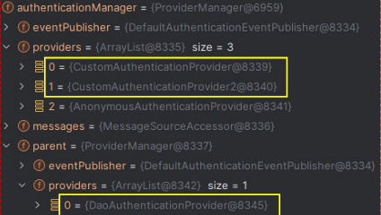

### AuthenticationProvider 



- AuthenticationManager 로 부터 위임받아 실질적인 인증을 수행하는 객체 
- 사용자 이름과 비밀번호를 기반으로 한 인증, 토큰 기반 인증, 지문 인식 등을 처리할 수 있다
- 인증 성공 후에는 Authentication 객체를 반환하고, 이 객체에는 사용자의 신원 정보와 인증된 자격 증명을 포함한다
- 인증 과정 중에 문제가 발생한 경우 AuthenticationException 과 같은 예외를 발생시켜 문제를 알리는 역할을 한다

### AuthenticationProvider 사용 방법 


#### 1. 커스텀 객체로 생성하여 사용 

- 다음은 빈이 아닌 Provider 객체를 생성하여 추가하는 방법 (POJO)

```java


public SecurityFilterChain securityFilterChain(HttpSecurity http) throws Exception {
    AuthenticationManagerBuilder managerBuilder = http.getSharedObject(AuthenticationManagerBuilder.class);
    
    managerBuilder.authenticationProvider(new CustomAuthenticationProvider());
    http.authenticationProvider(new CustomAuthenticationProvider2());
    
    http.authorizeHttpRequests(auth -> auth.anyRequest().authenticated());
    http.formLogin(Customizer.withDefaults());
    return http.build();
}
```
- AuthenticationManagerBuilder 를 사용하든, http 의 API(authenticationProvider() 메서드) 를 사용하든 결과는 같다

- 다음과 같이 Manager 에 Provider 가 추가된다



#### 2. 빈으로 생성

```JAVA
@Bean
public AuthenticationProvider customAuthenticationProvider(){
    return new CustomAuthenticationProvider();
}
```
- 빈 하나만 추가하면 아래 그림과 같이 부모 AuthenticationManager 에 DaoAuthenticationProvider 가 대체된다




<br>


DaoAuthenticationProvider 를 유지한 채로 커스텀 Provider 를 추가하는 방법
```java
@Bean
 public SecurityFilterChain securityFilterChain(HttpSecurity http, AuthenticationManagerBuilder builder, AuthenticationConfiguration configuration) 
throws Exception {
 AuthenticationManagerBuilder managerBuilder = http.getSharedObject(AuthenticationManagerBuilder.class);
 
 // 1. customAuthenticationProvider 를 ProviderManager 에 추가한다 
 managerBuilder.authenticationProvider(customAuthenticationProvider()); 
 
 ProviderManager providerManager = (ProviderManager)configuration.getAuthenticationManager();
 
 // 빈으로 등록하여 parent 에 추가된 CustomAuthenticationProvider 를 제거한다 
 providerManager.getProviders().remove(0);
 
 // parent 에 DaoAuthenticationProvider 를 추가한다
 builder.authenticationProvider(new DaoAuthenticationProvider());
 http.authorizeHttpRequests(auth -> auth.anyRequest().authenticated());
 return http.build();
 }

```

- 아래와 같이 DaoAuthenticationProvider 을 유지한 채로 커스텀 Provider 를 추가할 수 있다 




#### 3. 빈으로 2개 이상 추가 

```java
@Bean
 public SecurityFilterChain securityFilterChain(HttpSecurity http) throws Exception {
    AuthenticationManagerBuilder managerBuilder = http.getSharedObject(AuthenticationManagerBuilder.class);
    
    // 빈으로 등록된 Provider 추가 
    managerBuilder.authenticationProvider(customAuthenticationProvider());
    managerBuilder.authenticationProvider(customAuthenticationProvider2());
     
    http.authorizeHttpRequests(auth -> auth.anyRequest().authenticated());
    http.formLogin(Customizer.withDefaults());
    return http.build();
 }
 
 @Bean
 public AuthenticationProvider customAuthenticationProvider(){
    return new CustomAuthenticationProvider();
 }
 @Bean
 public AuthenticationProvider customAuthenticationProvider2(){
    return new CustomAuthenticationProvider2();
 }
```

- 빈으로 2개 이상 등록하면 자동으로 ProviderManager 의 providers 에 추가된다 

