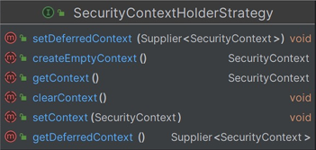

### SecurityContext

- 인증 결과물인 Authentication 을 저장하는 역할
- SecurityContextHolder 를 통해 접근하며, SecurityContext 는 ThreadLocal 영역에 저장되기 때문에  각 스레드가 자신만의 보안 컨텍스트를 유지한다
- 애플리케이션 전체 영역에서 접근 가능하다 

### SecurityContextHolder
- 인증된 사용자의 Authentication 객체를 담고 있는 SecurityContext 객체를 저장한다
- 다양한 저장 전략을 지원하기 위해 SecurityContextHolderStrategy 인터페이스를 사용한다
- SecurityContext 를 저장하기 위한 여러가지 전략이 있다 
    - SecurityContextHolder.setStrategyName(String) 로 전략 모드 변경 가능

### SecurityContextHolder 저장 모드

MODE_THREADLOCAL : 기본 모드로, 각 스레드가 독립적인 보안 컨텍스트를 가진다. 스레드 로컬에 SecurityContext 를 저장하는 방식이라고 보면된다

MODE_INHERITABLETHREADLOCAL : 부모 스레드로부터 자식 스레드로 보안 컨텍스트가 상속되며 작업을 스레드 간 분산 실행하는 경우 유용 할 수 있음

MODE_GLOBAL : 전역적으로 단일 보안 컨텍스트를 사용하며, 잘 사용되지 않는다

### SecurityContextHolderStrategy

MODE_THREADLOCAL 인 경우 ThreadLocalSecurityContextHolderStrategy 구현체가 생성되고,

MODE_INHERITABLETHREADLOCAL 인 경우, InheritableThreadLocalSecurityContextHolderStrategy 가 생성되고,

MODE_GLOBAL 인 경우, GlobalSecurityContextHolderStrategy 구현체가 사용된다

**그리고 SecurityContextHolder 가 SecurityContextHolderStrategy 를 포함한다**
그래서 SecurityContext 를 참조하기 위해 Security6 에서는 다음과 같이 사용한다

### SecurityContext 참조 및 삭제

- SecurityContext 참조 
    - SecurityContexHolder.getContextHolderStrategy().getContext()

- SecurityContext 삭제 
  - SecurityContexHolder.getContextHolderStrategy().clearContext()

### üSecurityContextHolder - SecurityContext 

- 스레드마다 할당되는 저장소에 SecurityContext 가 저장되기 때문에 동시성 문제가 발생하지 않는다
- 스레드 풀을 사용하는 경우, ThreadLocal 재사용 될 수 있기 때문에 클라이언트로 응답 직전에 항상 SecurityContext 를 삭제하여 내부 값을 비우고 있다

