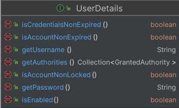

### UserDetailsService
-  UserDetailsService 의 주요 기능은 사용자의 주요 데이터를 불러와서 UserDetails 타입으로 반환하는 역할 
- AuthenticationProvider 가 해당 인터페이스를 주로 사용하며, 사용자가 시스템에 존재하는지를 검증한다 


AuthenticationProvider -> UserDetailsService -> UserRepository (DB 조회)


### 사용 방법
UserDetailsService 등록하기

```JAVA
@Bean
public SecurityFilterChain securityFilterChain(HttpSecurity http) throws Exception {
    AuthenticationManagerBuilder managerBuilder = http.getSharedObject(AuthenticationManagerBuilder.class);
    
    // 아래 2개는 모두 동일한 처리를 한다 
    managerBuilder.userDetailsService(customUserDetailsService());
    http.userDetailsService(customUserDetailsService());

    http.authorizeHttpRequests(auth -> auth.anyRequest().authenticated());
    http.formLogin(Customizer.withDefaults());
    
    return http.build();
 }
 
 @Bean
 public UserDetailsService customUserDetailsService(){
    return new CustomUserDetailsService();
 }
```


> AuthenticationProvider 를 커스텀마이징 한다면 AuthenticationProvider 에 UserDetailsService 를 주입해서 사용해야 한다 

<br>


---------------

### UserDetails

- Spring Security 에서 사용 하는 사용자 정보 타입
- UserDetails 는 인증 과정 중 인증 처리를 하기 위해 추후 Authentication 객체에 포함된다
- 스프링 시큐리티는 사용자가 직접 만들어 사용하는 사용자 정보는 모르기 때문에, 시큐리티에서 사용하는 UserDetails 타입의 사용자 정보를 제공해줘야 한다 



- getUsername() : 사용자 인증에 사용된 사용자 이름을 반환하며 null 을 반환하면 안된다
- getPassword() : 사용자 인증에 사용된 비밀번호를 반환한다
- isEnabled() : 사용자가 활성화되었는지 비활성화되었는지를 나타내며 비활성화된 사용자는 인증 불가 

<br>

[UserDetails 사용 과정]

1. AuthenticationProvider -> UserDetailsService -> UserRepository (DB 조회)

2. UserRepository 가 UserInfo 를 가져온다 ->  UserDetailsService 로 전달 

3. UserDetailsService 에서 UserInfo 를 통해 UserDetails 타입 객체 생성 -> AuthenticationProvider 로 전달

4. AuthenticationProvider 에서 Authentication 내부 principal 속성에 UserDetails 를 저장하여 반환 -> AuthenticationManager 로 전달 