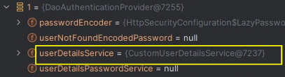

### UserDetailsService
-  UserDetailsService 의 주요 기능은 사용자의 주요 데이터를 불러와서 UserDetails 타입으로 반환하는 역할 
- AuthenticationProvider 가 해당 인터페이스를 주로 사용하며, 사용자가 시스템에 존재하는지를 검증한다 


AuthenticationProvider -> UserDetailsService -> UserRepository (DB 조회)


### 사용 방법
UserDetailsService 등록하기

```JAVA
@Bean
public SecurityFilterChain securityFilterChain(HttpSecurity http) throws Exception {
    AuthenticationManagerBuilder managerBuilder = http.getSharedObject(AuthenticationManagerBuilder.class);
    
    // 아래 2개는 모두 동일한 처리를 한다 
    managerBuilder.userDetailsService(customUserDetailsService());
    http.userDetailsService(customUserDetailsService());

    http.authorizeHttpRequests(auth -> auth.anyRequest().authenticated());
    http.formLogin(Customizer.withDefaults());
    
    return http.build();
 }
 
 @Bean
 public UserDetailsService customUserDetailsService(){
    return new CustomUserDetailsService();
 }
```



> AuthenticationProvider 를 커스텀마이징 한다면 AuthenticationProvider 에 UserDetailsService 를 주입해서 사용해야 한다 