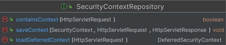

### SecurityContextRepository

- SecurityContext 를 세션 또는 Request 에 저장하고, 불러올 수 있게 해주는 객체 
-  사용자가 인증을 한 이후 요청에 대해 계속 사용자의 인증을 유지하기 위해 사용되는 클래스

[인증 요청인 경우]

1. Cleint - login 요청
2. 인증이 완료되면 AuthenticationFilter 에서 SecurityContext 안에 Authentication(인증정보)를 저장 
3. 그리고 SecurityContextRepository 를 사용해서 세션에 SecurityContext 를 저장한다

[인증 후 요청]

1. 인증이 필요한 url 로 요청
2. SecurityContextHolderFilter 에서 SecurityContextRepository 를 사용해서 세션으로부터 SecurityContext 가져온다

<br>

------------------------------------

### SecurityContextRepository 구조 



- containsContext() : 보안 컨텍스트가 저장소에 있는지 확인하는 용도
- saveContext() : 인증 요청 완료 시, 보안 컨텍스트를 저장소에 저장하는 용도
- loadDeferredContext() : Supply 객체를 반환 시켜, 실제 Context 를 필요한 시점에 사용하도록 한다

구현체는 HttpSessionSecurityContextRepository, RequestAttributeSecurityContextRepository 가 있으며,

시큐리티에서는 이 2개를 동시에 사용할 수 있도록 해당 2개 클래스를 모두 포함한 DelegatingSecurityContextRepository 를 사용한다 

---------------------

### SecurityContextHolderFilter

- 해당 필터는 주로 앞단에서  SecurityContextRepository 를 사용하여 SecurityContext를 얻고 이를 SecurityContextHolder 에 설정하는 필터 클래스이다

- 그리고 해당 필터는  SecurityContextRepository.saveContext()를 호출하지 않아 따로 저장소에 저장하지 않고, SecurityContext 를 불러오거나, 다음 필터로 전달해주는 역할만 한다

- Security5 에서는 앞단에서 SecurityContextPersistenceFilter 가 SecurityContextRepository.saveContext() 를 호출하여 세션에 SecurityContext 를 저장하였다


>Security6 에서는 SecurityContext 저장 같은 경우, 해당 과정이 필요한 필터에서 직접하도록 수정되었다고 볼 수 있다.
> 
> ex: 폼인증을 처리하는 필터에서 인증이 완료되면 SecurityContextRepository.saveContext() 를 호출하여 세션에 저장한다
> 
> Custom 인증 Filter 를 만드는 경우, DelegatingSecurityContextRepository 와 같은 객체를 전달하여 사용할 수 있도록 시큐리티에서 API도 제공함


--------------------------

### securityContextRepository 설정 과정 

- SecurityContext 를 "Session 객체" 또는 "request 객체"에 저장하거나,
- 해당 객체로 부터 SecurityContext 불러오기 위한 securityContextRepository 가 설정되는 과정을 설명한다 

<br>

**Filter 를 만드는 초기화 과정 속  SecurityContextConfigurer 의 init(), configure() 가 호출된다**

```java
public void configure(H http) {
    SecurityContextRepository securityContextRepository = this.getSecurityContextRepository();
    
    if (this.requireExplicitSave) {
        SecurityContextHolderFilter securityContextHolderFilter = (SecurityContextHolderFilter) this.postProcess(new SecurityContextHolderFilter(securityContextRepository));
        securityContextHolderFilter.setSecurityContextHolderStrategy(this.getSecurityContextHolderStrategy());
        http.addFilter(securityContextHolderFilter);
    } else {
        SecurityContextPersistenceFilter securityContextFilter = new SecurityContextPersistenceFilter(securityContextRepository);
        securityContextFilter.setSecurityContextHolderStrategy(this.getSecurityContextHolderStrategy());
        SessionManagementConfigurer<?> sessionManagement = (SessionManagementConfigurer) http.getConfigurer(SessionManagementConfigurer.class);
        SessionCreationPolicy sessionCreationPolicy = sessionManagement != null ? sessionManagement.getSessionCreationPolicy() : null;
        if (SessionCreationPolicy.ALWAYS == sessionCreationPolicy) {
            securityContextFilter.setForceEagerSessionCreation(true);
            http.addFilter((Filter) this.postProcess(new ForceEagerSessionCreationFilter()));
        }

        securityContextFilter = (SecurityContextPersistenceFilter) this.postProcess(securityContextFilter);
        http.addFilter(securityContextFilter);
    }

}
```

- 공유된 SecurityContextRepository 를 불러온다 
  - SecurityContextRepository 내부에는 DelegatingSecurityContextRepository 를 가지며
  - DelegatingSecurityContextRepository 는 HttpSession 와 RequestAttribute 에 Context 를 저장하기 위한 Repository 를 2개 가진다 ()

- requireExplicitSave 가 (default)true 이면 SecurityContextHolderFilter 를 만들 때 DelegatingSecurityContextRepository 를 전달한다
  - 즉 SecurityContextHolderFilter 는  명시적으로 Context 를 저장하기 위한 Repository 를 들고 있다 
  - // @TODO : SecurityContextHolderFilter 는 DelegatingSecurityContextRepository 를 사용하나 ..? 봐야함


**그다음 FormLoginConfigurer 의 부모인 AbstractAuthenticationFilterConfigurer 설정 과정을 본다**

```java
// AbstractAuthenticationFilterConfigurer.configure() 내부 
SecurityContextConfigurer securityContextConfigurer = (SecurityContextConfigurer) http.getConfigurer(SecurityContextConfigurer.class);
if( securityContextConfigurer !=null && securityContextConfigurer.isRequireExplicitSave() ){
    SecurityContextRepository securityContextRepository = securityContextConfigurer.getSecurityContextRepository();
    this.authFilter.setSecurityContextRepository(securityContextRepository);
}
```
- 폼인증을 담당하는 UsernamePasswordAuthenticationFilter 에 securityContextRepository 를 넣고 있다
- UsernamePasswordAuthenticationFilter 도 인증을 끝내고 Context를 세션에 저장해야하기 때문에 securityContextRepository 가 필요하다 

<br>
<br>

--------------------------

<br>
<br>
<br>

### 익명 사용자 요청 시, AnonymousAuthenticationToken 생성 과정 

- 익명 요청인 경우, AnonymousAuthenticationToken 을 만들어 SecurityContext 에 저장되는 과정을 설명한다 

SecurityContextHolderFilter
```java
    private void doFilter(HttpServletRequest request, HttpServletResponse response, FilterChain chain) throws ServletException, IOException {
        if (request.getAttribute(FILTER_APPLIED) != null) {
            chain.doFilter(request, response);
        } else {
            request.setAttribute(FILTER_APPLIED, Boolean.TRUE);
            
            Supplier<SecurityContext> deferredContext = this.securityContextRepository.loadDeferredContext(request);

            try {
                this.securityContextHolderStrategy.setDeferredContext(deferredContext);
                chain.doFilter(request, response);
            } finally {
                this.securityContextHolderStrategy.clearContext();
                request.removeAttribute(FILTER_APPLIED);
            }

        }
    }

```
- 세션과 request 객체로 부터 Supplier 타입의 deferredContext 를 불러온다 
- 구현체는 SupplierDeferredSecurityContext 가 되는데, 여러 Supplier 를 가진다
- **securityContextHolderStrategy 에 deferredContext 를 저장하고, 그다음 필터로 넘어간다**
- deferredContext 는 필요한 시점에 실제 SecurityContext 를 필요로 하는 곳에서 사용할 것이다


<br>
<br>

AnonymousAuthenticationFilter
```java
public void doFilter(ServletRequest req, ServletResponse res, FilterChain chain) throws IOException, ServletException {
  Supplier<SecurityContext> deferredContext = this.securityContextHolderStrategy.getDeferredContext();
  this.securityContextHolderStrategy.setDeferredContext(this.defaultWithAnonymous((HttpServletRequest)req, deferredContext));
  chain.doFilter(req, res);
}
```
- AnonymousAuthenticationFilter 에서도 설정만 하고 넘어간다 (당장 여기서 필요하지 않기 때문에)
- 그리고 defaultWithAnonymous() 를 호출하여 SecurityContext 를 생성하고 있다

<br>

```java
    private SecurityContext defaultWithAnonymous(HttpServletRequest request, SecurityContext currentContext) {
        Authentication currentAuthentication = currentContext.getAuthentication();
        if (currentAuthentication == null) {
            Authentication anonymous = this.createAuthentication(request);
            if (this.logger.isTraceEnabled()) {
                this.logger.trace(LogMessage.of(() -> {
                    return "Set SecurityContextHolder to " + anonymous;
                }));
            } else {
                this.logger.debug("Set SecurityContextHolder to anonymous SecurityContext");
            }

            SecurityContext anonymousContext = this.securityContextHolderStrategy.createEmptyContext();
            anonymousContext.setAuthentication(anonymous);
            return anonymousContext;
        } else {
            if (this.logger.isTraceEnabled()) {
                this.logger.trace(LogMessage.of(() -> {
                    return "Did not set SecurityContextHolder since already authenticated " + currentAuthentication;
                }));
            }

            return currentContext;
        }
    }
```

- getAuthentication() 를 통해 사용자를 가져오지만 (세션, request 객체 모두 탐색한다) 
- 여기에서는 익명 사용자 이기 때문에 null을 반환한다
- 익명 사용자 Authentication 를 만들어서 anonymousContext 에 저장한다 


<br>

AuthorizationFilter
```java
    private Authentication getAuthentication() {
        Authentication authentication = this.securityContextHolderStrategy.getContext().getAuthentication();
        if (authentication == null) {
            throw new AuthenticationCredentialsNotFoundException("An Authentication object was not found in the SecurityContext");
        } else {
            return authentication;
        }
    }
```
- 인가 처리 시점에 다시 getAuthentication() 을 하여 인증 객체를 가져온다
- 여기에서 익명 사용자 인증 객체가 반환된다 


> 결론적으로 익명사용자는 새로운 인증 객체를 만들어서 SecurityContext 에 저장한다
> 
> 인증된 사용자는 세션으로부터 가져와서 인증 객체를 SecurityContext 에 저장한다
