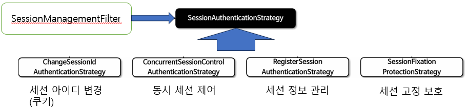
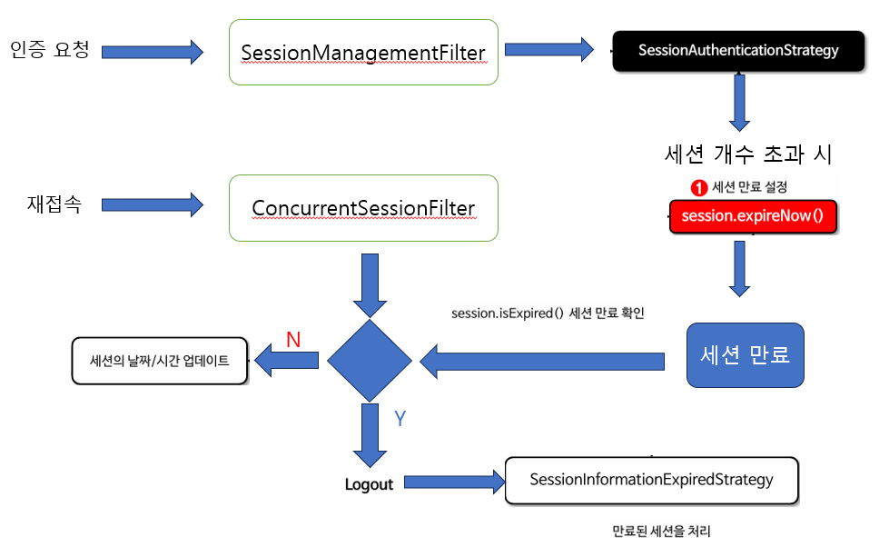

### 목차

- 동시 세션 제어 
- 세션 고정 보호
- 세션 생성 정책
- SessionManagementFilter & ConcurrentSessionFilter


### 1.동시 세션 제어

- 시큐리티에서 사용자가 같은 계정으로 몇개의 세션을 생성할 것인지 관리하는 전략
- maximumSessions 값을 통해 제어한다

maximumSessions(1) 로 세션 최대 개수를 1개로 설정한 경우, 다음 경우로 나뉘어진다

A,B 다른 브라우저에서 같은 계정으로 로그인 한다고 가정

**[사용자 세션 강제 만료 방식]**
1. A에서 로그인 [세션 개수 1]
2. B에서 로그인 [세션 개수 2]
3. 세션 최대 개수를 넘어 A 세션 만료처리
4. A에서 요청 보냄 -> 세션 강제 만료 [세션 개수 1]

**[사용자 인증 시도 차단 방식]**
1. A에서 로그인 [세션 개수 1]
2. B에서 로그인 [세션 개수 2]
3. B에서 인증 예외 발생하여 인증 거부 [세션 개수 1]

---------------------

#### 동시 세션 제어 코드

```JAVA
@Bean
public SecurityFilterChain securityFilterChain(HttpSecurity http) throws Exception {
    http.sessionManagement(session -> session
        .invalidSessionUrl(“/invalidSessionUrl”) // 이미 만료된 세션으로 요청을 하는 사용자를 특정 엔드포인트로 리다이렉션 할 Url 을 지정한다
        .maximumSessions(1) // 사용자당 최대 세션 수를 제어한다. 기본값은 무제한 세션을 허용한다
        .maxSessionsPreventsLogin(true) // true 이면 최대 세션 수(maximumSessions(int))에 도달했을 때 사용자의 인증을 방지한다
        // false(기본 설정)이면 인증하는 사용자에게 접근을 허용하고 기존 사용자의 세션은 만료된다
        .expiredUrl("/expired") // 세션을 만료하고 나서 리다이렉션 할 URL 을 지정한다
    );
    return http.build();
 }

```

---------------------------


### 2. 세션 고정 보호

공격자가 먼저 세션 쿠키 ID를 발급 받아, 사용자에게 전달하고

사용자가 해당 세션 쿠키 ID 로 인증을 받게되면 공격자도 해당 세션 쿠키 ID를 가지고 인증을 받을 수 있게 된다

```JAVA
@Bean
 public SecurityFilterChain securityFilterChain(HttpSecurity http) throws Exception {
    http.sessionManagement((session) -> session
    .sessionFixation(sessionFixation -> sessionFixation.newSession())
    );
    return http.build();
 }
```
- changeSessionId() : (기본값) 기존 세션을 유지하면서 세션 ID만 변경하여인증 과정에서 세션 고정 공격을 방지하는 방식
- newSession() : 새로운세션을 생성하고 기존 세션 데이터를 복사하지 않는 방식 (SPRING_SECURITY_ 로 시작하는 속성만 복사)
- migrateSession() : 새로운 세션을 생성하고 모든 기존 세션 속성을 새 세션으로 복사
- none() : 기존 세션을 그대로 사용

------------------------


### 3. 세션 생성 정책

스프링 시큐리티에서 인증된 사용자에 대한 세션을 어떻게 생성하고 관리할지 결정할 수 있도록 API를 제공한다

<br>

**[세션 생성 정책 전략]** 

**1. SessionCreationPolicy. ALWAYS**
- 인증 여부에 상관없이 항상 세션을 생성한다
- FilterChain 앞단에 ForceEagerSessionCreationFilter 를 추가하고, 해당 필터에서 세션을 강제로 생성한다

----

**2. SessionCreationPolicy.NEVER**
- 스프링 시큐리티가 세션을 생성하지 않지만 애플리케이션이 이미 생성한 세션은 사용할 수 있다
- 잘 사용하지 않는다

-----

**3. SessionCreationPolicy. IF_REQUIRED**
- 필요한 경우에만 세션을 생성한다. 예를 들어인증이 필요한 자원에 접근할 때 세션을 생성
- 기본값 설정이다 

---

**4. SessionCreationPolicy. STATELESS**
- 세션을 전혀 생성하거나 사용하지 않는다
- 인증 필터는인증 완료 후 SecurityContext 를 세션에 저장하지 않으며 JWT 와 같이 세션을 사용하지 않는 방식으로 인증을 관리할 때 유용
-  SecurityContextHolderFilter 는 세션 단위가 아닌 요청 단위로 항상 새로운 SecurityContext 객체를 생성하므로 컨텍스트 영속성이 유지되지 않는다


---
세션 생성 정책 코드
```java
  http.sessionManagement((session) -> session
            .sessionCreationPolicy(SessionCreationPolicy.STATELESS
```

> STATELESS 설정을 하더라도 인증 기능에 한해서만 사용하지 않을뿐
> 
> CSRF 기능과 같이 세션을 사용해야 하는 경우에는 사용한다 

------------------

<br>

### 4. SessionManagementFilter

SessionManagementFilter 는 다음과 같은 역할을 한다

- 사용자 인증을 감지하고, 세션 고정 보호 메커니즘을 활성화한다
- 동시 다중 로그인을 확인하고 세션 정책에 맞게 동시 세션을 제어한다
- 세션을 생성하는 등 세션 정보를 관리한다
- 스프링 시큐리티 6 이상에서는 SessionManagementFilter 가 기본적으로 설정 되지 않으며 세션관리 API 를 설정을 통해 생성할 수 있다


[세션 구성 요소]



- SessionManagementFilter 는 SessionAuthenticationStrategy 를 호출하여 세션 관련 활동을 수행한다 
- 세션 정책은 SessionCreationPolicy(Enum 타입)으로 제공한다 
  - **ALWAYS,  NEVER,  IF_REQUIRED,  STATELESS**

RegisterSessionAuthenticationStrategy
- 인증에 성공했을 때, 세션 정보를 저장하거나 읽어오는 것 등등 을 담당
- 동시 세션 제어 등을 할 때 같이 사용되어 진다

------------------------

<br>

### 5. ConcurrentSessionFilter

- 각 요청에 대해 SessionRegistry에서 SessionInformation 을 검색하고 세션이 만료로 표시되었는지 확인하고, 만료되었다면 로그아웃 처리를 수행한다 (해당 세션 제거)
- 만료되지 않았다면,  SessionRegistry.refreshLastRequest(String)를 호출하여 등록된 세션들이 항상 '마지막 업데이트' 날짜/시간을 가지도록 한다




