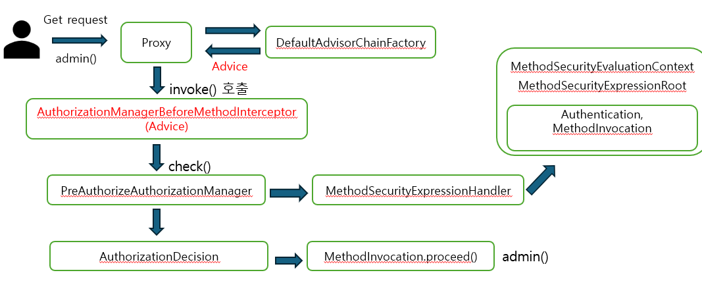

### 메서드 권한 부여 초기화 과정

> @PreAuthorize("hasAuthority('ROLE_ADMIN')")

1. 스프링에서 전체 빈을 탐색할 때, 보안 메서드가 적용된 메서드를 체크한다
2. 보안이 설정된 메서드를 찾으면 스프링은 그 빈의 프록시 객체를 생성 - 기본적으로 Cglib 방식 
3. 해당 보안 메서드에 맞는 인가처리 기능을 하는 Advice를 찾아 등록
4. 이제 해당 빈에 요청이나 참조를 하게되면, 프록시가 나오도록 처리됨
5. 초기화 과정 종료
6. 사용자가 요청을 보내면 프록시 객체가 대신 처리함
7. Advice는 메소드 진입 전 인가 처리를 하고, 인가 처리가 성공하면 실제 객체의 메소드를 호출 

<br>

### @PreAuthorize 처리 구조 



```java
@PreAuthorize("hasAuthority('ROLE_ADMIN')")
public void admin() { …}
```
1. Proxy 가 요청을 받아, DefaultAdvisorChainFactory 에 class,method 정보를 전달
2. Advice인 AuthorizationManagerBeforeMethodInterceptor 를 받아, invoke() 호출
3. PreAuthorizeAuthorizationManager 의 check 함수를 통해 인가 처리 시작
4. MethodSecurityExpressionHandler 에서 시작하여, ROLE_ADMIN과 Authentication 의 GrantedAuthority 를 검사
5. 반환 받은 AuthorizationDecision 이 false 면 예외 발생 
6. AuthorizationDecision 가 true이면 실제 요청한 메소드인 admin() 실행 

<br>

### 메서드 인터셉터 구조

#### MethodInterceptor
1. AuthorizationManagerBeforeMethodInterceptor
   - 정해진 AuthorizationManager 를 통해 해당 사용자(Authentication)이 해당 보안 메서드를 호출할 수 있는지 여부를 체크하는 인터셉터
   
2. AuthorizationManagerAfterMethodInterceptor
    - 지정된 AuthorizationManager 를 사용하여 Authentication 이 보안 메서드의 반환 결과에 접근 할 수 있는지 여부를 결정할 수 있
      는 구현체이다
3. PreFilterAuthorizationMethodInterceptor
    - @PreFilter 어노테이션에서 표현식을 평가하여 메소드 인자를 필터링 하는 구현체이다
4. PostFilterAuthorizationMethodInterceptor
    - @PostFilter 어노테이션에서 표현식을 평가하여 보안 메서드에서 반환된 객체를 필터링 하는 구현체이다


### AOP

JointPoint : 클래스, 필드, 메서드 등 대상 , JointPoint.proceed() 를 호출하여, 실제 대상을 호출함

PointCut: 어드바이스가 실행되어야 하는 적용 지점이나 조건 
