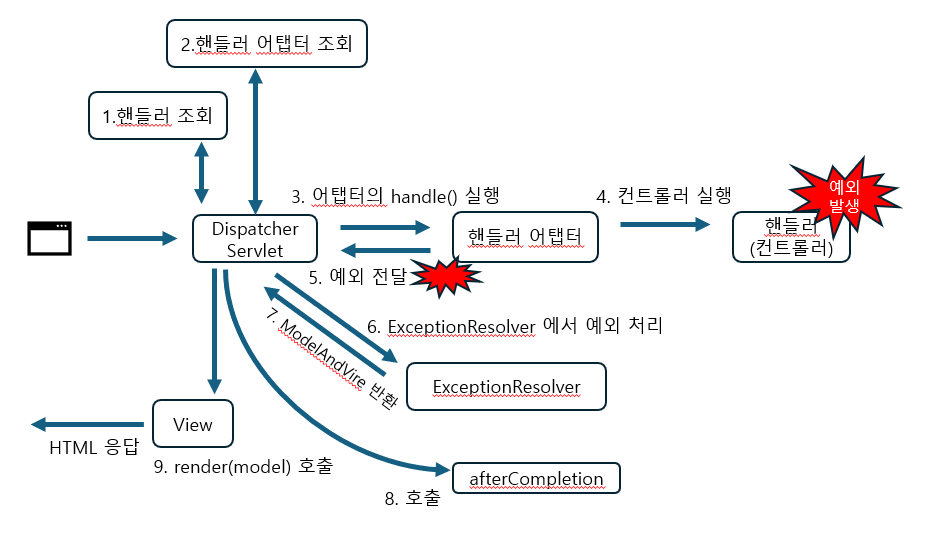

## 1. Exception 

개발자가 만든 로직에서 예외가 발생 시, 흐름 과정

WAS << 필터 << 서블릿 << 인터셉터 << 컨트롤러(예외 발생 지점)

```java
@GetMapping("/error-ex")
public void errorEx() {
	throw new RuntimeException("예외 발생!");
}
```
```properties
# 스프링 부트가 제공하는 기본 예외 페이지 제거
server.error.whitelabel.enabled=false
```

RuntimeException 발생 시, 
HTTP Status 500 – Internal Server Error 화면이 보인다.

즉 Exception 발생 시, WAS에서 500 화면을 보내고 있는 것이다

<br>

## 2. response.sendError(HTTP 상태 코드, 오류 메시지)

sendError 를 사용하면 상태 코드와 메시지를 전달할 수 있다.

```java
@GetMapping("/error-500")
public void error500(HttpServletResponse response) throws IOException {
    response.sendError(500);
}
```
sendError 흐름

WAS(sendError 기록 확인) << 필터 << 서블릿 << 인터셉터 << 컨트롤러
(response.sendError() 실행)

- sendError 기록이 있으면, 오류 코드와 메시지를 고객에게 보여준다.


## 3. 오류 화면 제어
과거에는 web.xml 을 통해 설정했지만, 현재는 부트에서 제공하는 방식으로 사용된다

```java
@Component
public class WebServerCustomizer implements
WebServerFactoryCustomizer<ConfigurableWebServerFactory> {
	
    @Override
    public void customize(ConfigurableWebServerFactory factory) {
        ErrorPage errorPage404 = new ErrorPage(HttpStatus.NOT_FOUND, "/errorpage/404");
        ErrorPage errorPage500 = new ErrorPage(HttpStatus.INTERNAL_SERVER_ERROR, "/error-page/500");
        ErrorPage errorPageEx = new ErrorPage(RuntimeException.class, "/error-page/500");
        factory.addErrorPages(errorPage404, errorPage500, errorPageEx);
    }
	
}
```

factory 에 ErrorPage(코드, 경로) 를 설정해두면 <br>

response.sendError(500) 를 호출하면 errorPage500을 호출하게 되는 것이다.


### [정리] 예외 처리 방법

 1. Exception 발생
    - WAS(여기까지 전파) <- 필터 <- 서블릿 <- 인터셉터 <- 컨트롤러(예외발생)
2.  sendError 사용
    - WAS(sendError 기록 확인) <- 필터 <- 서블릿 <- 인터셉터 <- 컨트롤러(sendError())


### 오류 결과 처리까지 흐름
1. WAS는 RuntimeRexception 발생 시, 아래 오류페이지 정보를 확인한다

    " **new ErrorPage(RuntimeException.class, "/error-page/500")** "

2. . WAS는 오류 페이지를 출력하기 위해 /error-page/500 를 다시 요청한다.

   WAS(`/error-page/500` 다시 요청) -> 필터 -> 서블릿 -> 인터셉터 -> 컨트롤러(/error-page/500)
   -> View
- 그리고 부트는 BasicErrorController 컨트롤러를 미리 등록하는데, ErrorPage 에서 등록한 /error 를 매핑해서 처리하는 컨트롤러다.
    즉 `/error-page/500` 를 처리하는 로직이 미리 만들어진다.

<br>

## 4. API 예외 
Json 방식으로 요청하여 예외가 발생한 경우, 응답에 사용할 예외 응답을 추가하면 된다.

```java
@RequestMapping(value = "/error-page/500", produces = MediaType.APPLICATION_JSON_VALUE)
public ResponseEntity<Map<String, Object>> errorPage500Api(HttpServletRequest request, HttpServletResponse response) {
    Map<String, Object> result = new HashMap<>();
	
    Exception ex = (Exception) request.getAttribute(ERROR_EXCEPTION);
    result.put("status", request.getAttribute(ERROR_STATUS_CODE));
    result.put("message", ex.getMessage());
	
    Integer statusCode = (Integer)request.getAttribute(RequestDispatcher.ERROR_STATUS_CODE);
    return new ResponseEntity(result, HttpStatus.valueOf(statusCode));
}
```

- produces = MediaType.APPLICATION_JSON_VALUE 설정이기 때문에 HTTP Header의
  Accept 의 값이 application/json 일 때 해당 메서드가 호출된다.

```json
{
 "message": "잘못된 사용자",
 "status": 500
}
```

<br>

## 5. API 예외처리 - 스프링 부트 기본 오류 처리 

```java
// 스프링 부트에 포함된 BasicErrorController
// 모두 "/error" 경로를 처리
@RequestMapping(produces = MediaType.TEXT_HTML_VALUE)
public ModelAndView errorHtml(HttpServletRequest request, HttpServletResponse response) {}

@RequestMapping
public ResponseEntity<Map<String, Object>> error(HttpServletRequest request) {}
```

- 클라이언트 요청의 Accept 해더 값이 text/html 인 경우에는 errorHtml() 을 호출해서 view를 제공한다
- 그 외 요청에는 ResponseEntity 로 HTTP Body에 JSON 데이터를 반환

<br>

직접 구현한 WebServerCustomizer 가 없다면 아래처럼 스프링 부트는 BasicErrorController 가 제공하는 기본 정보들을 활용해서 오류 API를 생성해준다

```json
{
 "timestamp": "2021-04-28T00:00:00.000+00:00",
 "status": 500,
 "error": "Internal Server Error",
 "exception": "java.lang.RuntimeException",
 "trace": "java.lang.RuntimeException: 잘못된 사용자\n\t athello.exception.web.api.ApiExceptionController.getMember(ApiExceptionController.
java:19...,
 "message": "잘못된 사용자",
 "path": "/api/members/ex"
}
```

다음 옵션으로 자세한 정보를 추가할 수 있다.
- server.error.include-binding-errors=always
- server.error.include-exception=true
- server.error.include-message=always
- server.error.include-stacktrace=always


<br>
<br>

## 6. API 예외 처리 - HandlerExceptionResolver 

스프링부트는 기본적으로 RuntimeException, IllegalArgumentException 예외가 발생하면 모두 500으로 처리한다.
IllegalArgumentException 을 400으로 처리하기 위해서는 별도로 설정이 필요하다.

이떄 발생한 에러를 해결하고, 새로 정의할 수 있는 메커니즘을 제공하는 것이 HandlerExceptionResolver 이다.
해당 Resolver를 적용하면 흐름은 다음과 같다.



<br>

WebMvcConfiguration에 커스텀 HandlerExceptionResolver 를 등록하였다.
```java
// HandlerExceptionResolver
@Override
public ModelAndView resolveException(HttpServletRequest request, HttpServletResponse response, Object handler, Exception ex) {
	try {
		if (ex instanceof IllegalArgumentException) {
			log.info("IllegalArgumentException resolver to 400");
			response.sendError(HttpServletResponse.SC_BAD_REQUEST, ex.getMessage());

			return new ModelAndView();
		}
	} catch (IOException e) {
		log.error("resolver ex", e);
	}
	return null;
}
```

또한 UserException일 경우 응답을 커스텀해서 보내려면
```java
if (ex instanceof UserException) {
    log.info("UserException resolver to 400");
    String acceptHeader = request.getHeader("accept");
    response.setStatus(HttpServletResponse.SC_BAD_REQUEST);

    if ("application/json".equals(acceptHeader)) {
        Map<String, Object> errorResult = new HashMap<>();
        errorResult.put("ex", ex.getClass());
        errorResult.put("message", ex.getMessage());

        String result = objectMapper.writeValueAsString(errorResult);

        response.setContentType("application/json");
        response.setCharacterEncoding("utf-8");
        response.getWriter().write(result);

    return new ModelAndView();
    }else {
        return new ModelAndView("error/400");
    }
}
```

이런식으로 직접 값을 설정해야하고, Resolver도 다시 등록해야한다. <br>
과정이 복잡하기 때문에 스프링에서 제공하는 ExceptionResolver 를 사용해보자

<br>

## 7. API 예외 처리 - 스프링이 제공하는 ExceptionResolver1

스프링부트는 HandlerExceptionResolverComposite 를 통해 Resolver를 관리하는데, 다음 순서로 등록한다.

1. ExceptionHandlerExceptionResolver
2. ResponseStatusExceptionResolver
3. DefaultHandlerExceptionResolver

## 7-1. ExceptionHandlerExceptionResolver
내부 예외의 코드,메시지를 변경하는 것은 response 에 직접 데이터를 설정해야 해서 매우 불편하다.
또 ExceptionHandler 를 직접 구현하여 ModelAndView 를 반환해야 것도 API에는 맞지 않는다. API 는 ModelAndView 가 필요없다.

이 문제는 @ExceptionHandler 를 사용하여 해결한다.

[사용 예시]
```java
@ExceptionHandler(IllegalArgumentException.class)
public ErrorResult illegalExHandle(IllegalArgumentException e) {
    log.error("[exceptionHandle] ex", e);
    return new ErrorResult("BAD", e.getMessage());
}
```
- @ExceptionHandler 애노테이션을 선언하고, 해당 컨트롤러에서 처리하고 싶은 예외를 지정한다
- 해당 예시는 IllegalArgumentException 또는 그 하위 자식 클래스를 모두 처리
- @ExceptionHandler({AException.class, BException.class}) 복수 예외 처리 가능

```java
@ExceptionHandler
public ResponseEntity<ErrorResult> userExHandle(UserException e) {} 
```
- @ExceptionHandler 에 예외를 생략할 수 있다. 생략하면 메서드 파라미터의 예외가 지정된다.
- https://docs.spring.io/spring-framework/reference/web/webmvc/mvc-controller/ann-exceptionhandler.html#mvc-ann-exceptionhandler-args

[실행 흐름]
```java
@ResponseStatus(HttpStatus.BAD_REQUEST)
@ExceptionHandler(IllegalArgumentException.class)
public ErrorResult illegalExHandle(IllegalArgumentException e) {
    log.error("[exceptionHandle] ex", e);
    return new ErrorResult("BAD", e.getMessage());
}
```

1. 컨트롤러에서 IllegalArgumentException 예외가 발생한다.
2. 예외가 발생하여, ExceptionResolver 가 순서대로 작동한다.
3. 먼저 우선순위 상 ExceptionHandlerExceptionResolver 를 먼저 실행한다.
4. ExceptionHandlerExceptionResolver 는 IllegalArgumentException 를 처리할 수 있는 @ExceptionHandler가 있는 메서드를 찾는다.
5. 해당 메서드를 찾으면 그 메서드를 실행시킨다. (해당 예제는 illegalExHandle())
6. illegalExHandle() 는  @RestController 안에 있으면 @ResponseBody 가 적용되어 Json 으로 응답이 가능하다.
7. @ResponseStatus(HttpStatus.BAD_REQUEST) 또한 적용이 되어 HTTP 상태 코드 400으로 응답한다.

```json
// 결과
{
 "code": "BAD",
 "message": "잘못된 입력 값"
}
```

물론 다음과 같이 ModelAndView를 반환하여 HTML 형식의 오류화면으로 보낼 수 있다.
```java
@ExceptionHandler(ViewException.class)
public ModelAndView ex(ViewException e) {
    log.info("exception e", e);
    return new ModelAndView("error");
}
```

### ControllerAdvice

```java
@RestControllerAdvice
public class ExControllerAdvice {
	@ResponseStatus(HttpStatus.BAD_REQUEST)
	@ExceptionHandler(IllegalArgumentException.class)
	public ErrorResult illegalExHandle(IllegalArgumentException e) {
		log.error("[exceptionHandle] ex", e);
		return new ErrorResult("BAD", e.getMessage());
	}

	@ExceptionHandler
	public ResponseEntity<ErrorResult> userExHandle(UserException e) {
		log.error("[exceptionHandle] ex", e);
		ErrorResult errorResult = new ErrorResult("USER-EX", e.getMessage());
		return new ResponseEntity<>(errorResult, HttpStatus.BAD_REQUEST);
	}
}
```
- @ControllerAdvice 는 대상으로 지정한 여러 컨트롤러에 @ExceptionHandler 와 검증에 사용되는 WebDataBinder를 초기화하는 @InitBinder를 적용시킬 수 있다.
- 대상을 지정하지 않으면 모든 컨트롤러에 적용시킬 수 있다.
- @RestControllerAdvice 는 @ControllerAdvice + @ResponseBody 를 나타낸다.


## 7-2. ResponseStatusExceptionResolver
- ResponseStatusExceptionResolver 는 예외에 따라서 HTTP 상태 코드를 지정해주는 역할
- @ResponseStatus 가 달려있는 예외, ResponseStatusException 예외를 처리한다.

[사용 예시]
```java
@ResponseStatus(code = HttpStatus.BAD_REQUEST, reason = "잘못된 요청 오류")
public class BadRequestException extends RuntimeException { ... }
```
- 해당 예외가 발생하면 ResponseStatusExceptionResolver 가 ResponseStatus 내용을 참고하여 응답에 적용한다.
- ResponseStatusExceptionResolver 내부적으로 response.sendError(statusCode, resolvedReason) 를 호출하여 다시 컨트롤러로 요청하는 것이다.
- reason 은 messages.properties 메시지 코드를 사용할 수 있다.

<br>

[참고]

@ResponseStatus 는 내가 만든 예외에만 적용할 수있고, 라이브러리의 예외에는 적용할 수가 없는 단점이 있는데,
ResponseStatusException 를 사용하여 해결하면 된다.
```java
throw new ResponseStatusException(HttpStatus.NOT_FOUND, "error.bad", new IllegalArgumentException());
```

## 7-3. DefaultHandlerExceptionResolver
- DefaultHandlerExceptionResolver 는 스프링 내부에서 발생하는 스프링 예외를 담당한다.
- 대표적으로 컨트롤러 인자에 타입 에러가 발생할 때 나오는 TypeMismatchException 이 있다.
- 파라미터 바인딩 에러는 컨트롤러에서 서블릿 컨테이너까지 오류가 올라가고, 500에러로 처리되는데,
  DefaultHandlerExceptionResolver 는 이것을 500 오류가 아니라 400 오류로 변경해준다. (클라이언트에서 잘못 보냈기 때문)

```java
@GetMapping("/api/default-handler-ex")
public String defaultException(@RequestParam Integer data) {
    return "ok";
}
```

- int 타입에 문자가 입력되면 아래 응답으로 처리된다.
```json
{
 "status": 400,
 "error": "Bad Request",
 "exception":
"org.springframework.web.method.annotation.MethodArgumentTypeMismatchException",
 "message": "Failed to convert value of type 'java.lang.String' to required
type 'java.lang.Integer'; nested exception is java.lang.NumberFormatException:
For input string: \"hello\"",
 "path": "/api/default-handler-ex"
}
```

