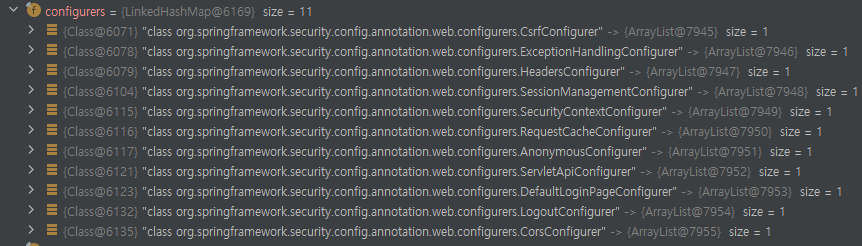
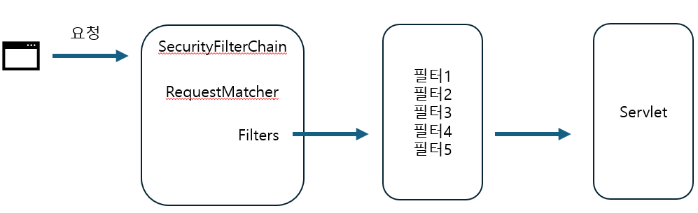

### Security 기초 이해

스프링 시큐리티를 사용한다면, 기본적인 웹 보안 기능이 자동으로 시스템에 연동되어 작동한다.

시큐리티 내부에 SpringBootWebSecurityConfiguration 클래스가 "자동 설정에 의한 기본 보안 설정 클래스"를 생성하게 되고,
해당 설정 클래스 덕분에 우리의 시스템에 기본적인 보안 기능이 연동되는 것이다.

__그럼 어떤 기본 보안 설정 클래스(빈)을 생성하는지 보자__

```java
import org.springframework.boot.autoconfigure.security.ConditionalOnDefaultWebSecurity;

@ConditionalOnDefaultWebSecurity
static class SecurityFilterChainConfiguration {
	@Bean
	@Order(SecurityProperties.BASIC_AUTH_ORDER)
	SecurityFilterChain defaultSecurityFilterChain(HttpSecurity http) throws Exception {
		http.authorizeHttpRequests((requests) -> requests.anyRequest().authenticated()); // 어떠한 요청이라도 인증을 받아야 한다
		http.formLogin(withDefaults()); // form 인증 방식을 제공 
		http.httpBasic(withDefaults()); // http basic 인증 방식 제공
		return http.build();
	}
}

```
- 먼저 HttpSecurity를 주입받아 사용한 뒤, SecurityFilterChain 를 반환하는 것을 볼 수 있다
- SecurityFilterChain 이 바로 기본 보안 설정 클래스이다.
- @ConditionalOnDefaultWebSecurity 은 조건이다. 아래를 보자

#### @ConditionalOnDefaultWebSecurity
```java
@Target({ ElementType.TYPE, ElementType.METHOD })
@Retention(RetentionPolicy.RUNTIME)
@Documented
@Conditional(DefaultWebSecurityCondition.class)
public @interface ConditionalOnDefaultWebSecurity {

}
```
- DefaultWebSecurityCondition 클래스가 조건으로 걸려있다

#### DefaultWebSecurityCondition
```java
class DefaultWebSecurityCondition extends AllNestedConditions {

	DefaultWebSecurityCondition() {
		super(ConfigurationPhase.REGISTER_BEAN);
	}

	@ConditionalOnClass({ SecurityFilterChain.class, HttpSecurity.class })
	static class Classes {

	}

	@ConditionalOnMissingBean({ SecurityFilterChain.class })
	static class Beans {

	}

}
```
- ConditionalOnClass, ConditionalOnMissingBean 이 있는데, 이 2개의 조건이 참이어야 한다
- ConditionalOnClass 는 설정된 클래스들이 클래스 경로에 존재하면 true (시큐리티 의존성을 추가하면 모두 추가된다)
- ConditionalOnMissingBean 는 설정된 클래스를 직접 생성하지 않았다면 true 
- 모두 참이면 위에서 언급한 defaultSecurityFilterChain 메서드를 실행할 수 있다

### 초기화 작업

앱 실행 시, 인증,인가 처리 관련 설정을 하는 인터페이스는 SecurityBuilder 와 SecurityConfigurer 가 있다.

- SecurityBuilder 는 웹 보안을 구성하는 클래스를 생성하며, 구현체로 WebSecurity, HttpSecurity 가 존재
- SecurityConfigurer 는 HTTP 요청에 관한 보안처리를 담당하는 필터를 생성하고, 초기화 설정을 돕는다
- SecurityBuilder 가 SecurityConfigurer 를 참조하여 사용하며, SecurityConfigurer 를 통해 인증/인가 초기화 작업을 진행한다

<br>

SecurityBuilder 의 구현체는 WebSecurity, HttpSecurity, AuthenticationManagerBuilder

SecurityConfigurer 의 구현체는 SecurityContextConfigurer, FormLoginConfigurer, CsrfConfigurer 등이 있다.

SecurityBuilder -> SecurityConfigurer의 구현체를 통해 인증/인가에 관련된 초기화 작업 진행

### 초기화 구체적인 순서

1. AutoConfiguration 의 build() 를 통해 빌더 클래스(SecurityBuilder) 생성
    - HttpSecurity(SecurityBuilder 를 상속받은) 객체 생성
2. HttpSecurity 가 SecurityConfigurer 타입의 설정 클래스를 생성
    - FormLoginConfigurer, HttpBasicConfigurer, PasswordManagementConfigurer ... 등 생성
    - SecurityConfigurer 는 init(SecurityBuilder b), configurer(SecurityBuilder b) 메서드를 가지고 있다
3. 설정 클래스는 init(SecurityBuilder b), configurer(SecurityBuilder b) 를 사용해서 필터 생성과 초기화 작업을 진행
    - 인자로 HttpSecurity(SecurityBuilder 타입)가 전달된다
    - init, configurer 안에서 각종 보안 필터들을 생성한다.

### 디버깅 해보기

### HttpSecurityConfiguration class

```java
@Bean(HTTPSECURITY_BEAN_NAME)
@Scope("prototype")
HttpSecurity httpSecurity() throws Exception{
        LazyPasswordEncoder passwordEncoder=new LazyPasswordEncoder(this.context);
        AuthenticationManagerBuilder authenticationBuilder=new DefaultPasswordEncoderAuthenticationManagerBuilder(
        this.objectPostProcessor,passwordEncoder);
        authenticationBuilder.parentAuthenticationManager(authenticationManager());
        authenticationBuilder.authenticationEventPublisher(getAuthenticationEventPublisher());
        HttpSecurity http=new HttpSecurity(this.objectPostProcessor,authenticationBuilder,createSharedObjects());
        WebAsyncManagerIntegrationFilter webAsyncManagerIntegrationFilter=new WebAsyncManagerIntegrationFilter();
        webAsyncManagerIntegrationFilter.setSecurityContextHolderStrategy(this.securityContextHolderStrategy);
        // @formatter:off
        http
            .csrf(withDefaults())
            .addFilter(webAsyncManagerIntegrationFilter)
            .exceptionHandling(withDefaults())
            .headers(withDefaults())
            .sessionManagement(withDefaults())
            .securityContext(withDefaults())
            .requestCache(withDefaults())
            .anonymous(withDefaults())
            .servletApi(withDefaults())
            .apply(new DefaultLoginPageConfigurer<>());
        http.logout(withDefaults());
        // @formatter:on
        applyCorsIfAvailable(http);
        applyDefaultConfigurers(http);
        return http;
        }

```


```java
public HttpSecurity csrf(Customizer<CsrfConfigurer<HttpSecurity>>csrfCustomizer)throws Exception{
        ApplicationContext context=getContext();
        csrfCustomizer.customize(getOrApply(new CsrfConfigurer<>(context)));
        // new CsrfConfigurer 클래스를 생성해서 어딘가에 적용(Apply)하고 있다
        return HttpSecurity.this;
}

```
- CsrfConfigurer는 SecurityConfigurer 를 상속받는다 
- Configurer 설정 클래스를 이용해서 초기화 준비 작업을 진행한다는 것이 중요 

```java
public HttpSecurity exceptionHandling(
            Customizer<ExceptionHandlingConfigurer<HttpSecurity>> exceptionHandlingCustomizer) throws Exception {
        exceptionHandlingCustomizer.customize(getOrApply(new ExceptionHandlingConfigurer<>()));
        return HttpSecurity.this;
}
```

- exceptionHandling 도 동일하게 Configurer 를 사용해서 처리
- HttpSecurityConfiguration 의 httpSecurity() 에서 이러한 작업을 10개 정도하면서, 인증 및 인가 작업을 진행한다
- 그리고 HttpSecurity 를 반환해서 빈을 생성한다 

### SpringBootWebSecurityConfiguration class
```java
@Configuration(proxyBeanMethods = false)
@ConditionalOnDefaultWebSecurity
static class SecurityFilterChainConfiguration {

   @Bean
   @Order(SecurityProperties.BASIC_AUTH_ORDER)
   SecurityFilterChain defaultSecurityFilterChain(HttpSecurity http) throws Exception {
      http.authorizeHttpRequests((requests) -> requests.anyRequest().authenticated());
      http.formLogin(withDefaults()); // 여기서도 설정 클래스 생성
      http.httpBasic(withDefaults()); // 여기에서도 설정 클래스 생성 
      return http.build(); // build 에서 설정 클래스의 init, configure 메서드를 통해 초기화 진행 
   }

}
```
- 그리고 SpringBootWebSecurityConfiguration 의 defaultSecurityFilterChain 인자에 위에서 만든 HttpSecurity 를 주입해서 사용한다 
- 즉 인증 및 인가 작업을 마친 HttpSecurity 가 들어온다 




- 또한 http 내부에 configurers 클래스가 생성되어 있는 것을 볼 수 있다.
- 그리고 http.build()에서 각 configurer 마다 init, configure 메서드를 호출하여 초기화를 본격적으로 진행한다

<br>

## HttpSecurity 
- 결국 HttpSecurityConfiguration 에서 HttpSecurity(SecurityBuilder) 를 만들어내고
- SecurityFilterChainConfiguration 에서 해당 HttpSecurity 를 사용해서, SecurityFilterChain 빈을 생성
- SecurityFilterChain 를 만드는 것이 최종 목표 

또한 Configurer 내부에서 init, configure 메서드를 통해 초기화 작업을 진행하면
각종 필터들이 만들어지게 되는데, 필터들은 SecurityFilterChain 빈안의 리스트에 저장된다.
SecurityFilterChain 는 인증/인가에 필요한 필터들을 가지고 있는 필터 체인이다.


## SecurityFilterChain 
- boolean matches(request), List<Filter> getFilter() 메서드를 가지고 있다
- mathes() 는 현재 요청이 현재 SecurityFilterChain 을 사용해서 처리해야 하는지 판단하는 메서드
- getFilter() 는 어떤 필터들이 현재 필터체인에 포함되어 있는지 알 수 있다


- Matcher를 통해 적절한 SecurityFilterChain 을 찾고, 필터를 적용한다

## WebSecurity [WebSecurity > HttpSecurity]
- 다시 정리하면, HttpSecurity 를 통해 SecurityFilterChain 을 만들었으며
- WebSecurity는 SecurityFilterChain 빈을 SecurityBuilder 에 다시 저장하고,
  WebSecurity가 build()를 호출하면 SecurityFilterChain 을 꺼내서 FilterChainProxy 생성자에 전달하는 역할을 수행 

#### * WebSecurity는 여러개의 HttpSecurity 가 만든 여러 SecurityFilterChain 을 가질 수 있다. (다중 보안 설정)

### 돌아와서 SecurityFilterChain , FilterChainProxy
- 요청이 오면 SecurityFilterChain 에 있는 필터들이 실행되는데, 사실 SecurityFilterChain 이 직접 수행하지 않고, 다른 클래스에게 위임한다
- 바로 FilterChainProxy 가 필터들을 처리하는 것
- 초기화 과정은 FilterChainProxy 생성하는 것이 최종 목표이고 FilterChainProxy 이 모든 필터를 가지고 있다


<br>

## DelegatingFilterProxy
[@@@@그림]
- Filter는 원래 WAS에서 생성되고 종룔되는 것으로 스프링 관련 기술(EX. 의존성주입)을 사용할 수 없다
- 스프링에서 필터를 사용하면서, 스프링 기술을 사용하기 위해 만든것이 DelegatingFilterProxy


