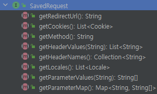

## 인증 프로세스

### - 폼인증

- HTTP 기반의 폼 로그인 인증 메커니즘을 사용하는 API
- UsernamePasswordAuthenticationFilter 가 생성되어 폼 인증 처리를 담당한다.


### UsernamePasswordAuthenticationFilter

- 로그인 시 사용되는 

로그인 요청 시, 로직 흐름
1. AbstractAuthenticationProcessingFilter 에서 Matcher를 통해 로그인 요청인지 판단
2. 로그인 요청이면 attemptAuthentication 메서드로 인증 시작 
3. 전달받은 id,pw 로 UsernamePasswordAuthenticationToken 생성
4. AuthenticationManager.authenticate() 로 인증 처리 시작
5. 인증 성공 시, Authentication(UsernamePasswordAuthenticationToken) 에 UserDetail,권한이 담겨 반환
6. SessionAuthenticationStrategy 세션 관련 작업 수행
7. Authentication을 SecurityContext 에 저장하고, SecurityContextHolder를 통해 Context를 세션에 저장
8. RememberMeServices.loginSuccess 호출 (선택)
9. ApplicationEventPublisher.publishEvent() 인증 성공 이벤트 게시
10. AuthenticationSuccessHandler 호출 


<br>

### RememberMe 인증

- 로그인 시, 인증 정보를 기억하는 기능

### RememberMeServices 

- 기억하기 인증을 위한 토큰을 생성한다
- TokenBasedRememberMeServices : 해싱을 사용하여 쿠키 기반 토큰을 만들기 위해 사용
- PersistentTokenBasedRememberMeServices : 생성한 토큰을 DB와 같은 매체에 저장할 때 사용


rememberMe() API
```java

```


### RememberMeAuthenticationFilter 

1. RememberMeAuthenticationFilter 에서 Authentication 있는지 판단
2. 없으면 리멤버미 쿠기 전달해서 RemeberMeServices.authlogin() 실행 
3. 해당 쿠키로 사용자 정보 가져와서 RememberMeAuthenticationToken 생성
4. 해당 토큰으로 AuthenticationManger 를 통해 인증 처리 시작
5. 성공 시, Authentication 을 SecurityConext에 저장하고, Context를 세션에 저장 


### RequestCache - SavedRequest 


### 프로세스 

[인증 받지 않은 상태로 접근]
1. HttpSessionRequestCache 가 DefaultSavedRequest 생성해서 세션에 저장 



