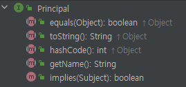
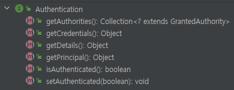

## 인증 아키텍처

- 인증 정보 Authentication
- 보안 컨텍스트 SecurityContext, SecurityContextHolder
- 인증 관리자 AuthenticationManager : 관리만 하는 역할
- 인증 제공자 AuthenticationProvider : 인증 처리에 더 가까운 
- 사용자 상세 서비스 UserDetailsService
- 사용자 상세 UserDetails : 해당 타입으로 시큐리티에서 유저로 사용한다

### 인증 프로세스

1. 요청을 받아 DelegatingFilterProxy 에서 스프링 컨테이너로 요청 전달
2. FilterChainProxy (스프링 빈) 에서 인증 필터 진행
3. 여러 필터 진행 
4. 앞에 여러 필터를 거쳐, AuthenticationFilter 도착 
5. AuthenticationFilter 에서 Authentication 객체 생성 
6. AuthenticationManager 에 Authentication 전달
7. <strong>AuthenticationManager 가 AuthenticationProvider 에게 위임</strong>
8. AuthenticationProvider -> UserDeailsService 로 UserDetails 가져옴
9. UserDetails의 비밀번호가 요청온 비밀번호와 맞는지 비교 (PasswordEncoder 사용)
10. 성공하면 Authentication 반환 
11. Authentication 을 SecurityContext 에 저장,(SecurityContextHolder를 사용하여)

### Authentication (스프링)

- 사용자 인증 정보를 저장하는 객체, 인증 이후 SecurityContext 에 저장되어 어플리케이션 전역으로 사용 가능
- Principal (자바 API) 을 상속 받고 있다. 
- Principal 은 인증 주체 , 인증 요청 전에는 사용자 아이디, 인증 후에는 UserDetails 를 저장하는 용도로 사용 

getPrincipal() : 인증 주체를 의미하며 인증 요청의 경우 사용자 이름, 인증 후 UserDetails 타입 객체로 사용

getCredentials() : 인증 주체가 올바른 것을 나타내는 자격 증명으로 비밀번호 저장 (보통 사용 안함)

getAuthorities() : 권한

getDetails() : 세부 사항, IP주소, 인증서 일련 번호 등

isAuthenticated() : 인증 상태 반환

setAuthenticated(boolean) : 인증 상태 설정

 

-------------------------------------------------------

[인증전] Authentication

- principal : username
- cridentials : password
- authorities : 
- authenticated : false

[인증 후] Authentication

- principal : UserDetails
- cridentials : 
- authorities : ROLE_USER (GrantedAuthority 타입의 컬렉션)
- authenticated : true

AuthenticationFilter 에서 인증 완료된 Authentication 을 Context에 저장한다.

