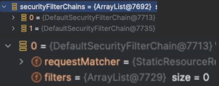

### 인가 프로세스 

### 요청 기반 권한 부여 HttpSecurity.authorizeHttpRequests()

### 표현식/커스텀 권한 부여 

### 요청 기반 권한 부여 HttpSecurity.securityMatcher()

### HttpSecurity.securityMatchers(Customizer<RequestMatcherConfigurer>)

### 메서드 기반 권한 부여
1. @PreAuthorize @PostAuthorize
2. @PreFilter @PostFilter
3. @Secured
4. JSR-250
5. 메타 주석 사용

### 정적자원관리

[흐름도]
- WebSecurityCustomizer 생성
- WebSecurity - ignoreList 를 FilterChain에 전달 (FilterChain은 Matcher랑 필터를 가지고 있음)
- 총 2개의 필터체인 생성 (정적 경로는 필터가 포함되지 않는다)

### 계층 권한 부여