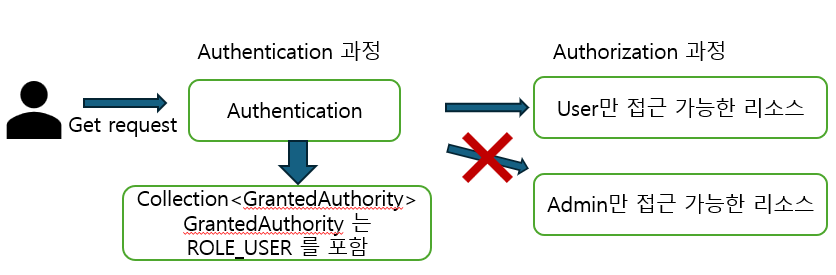
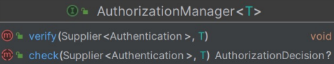
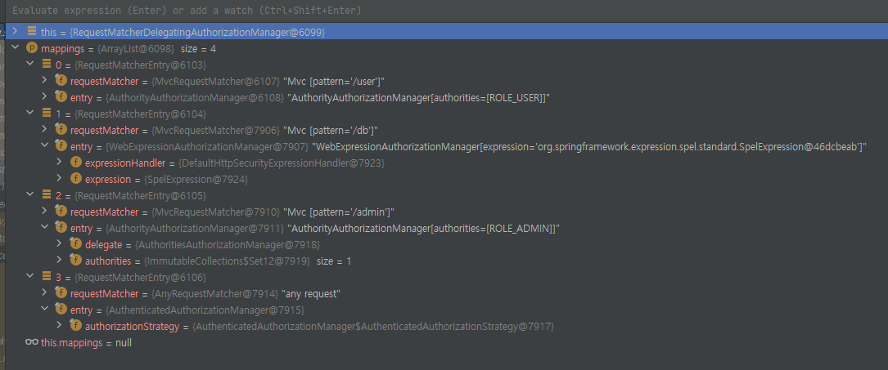
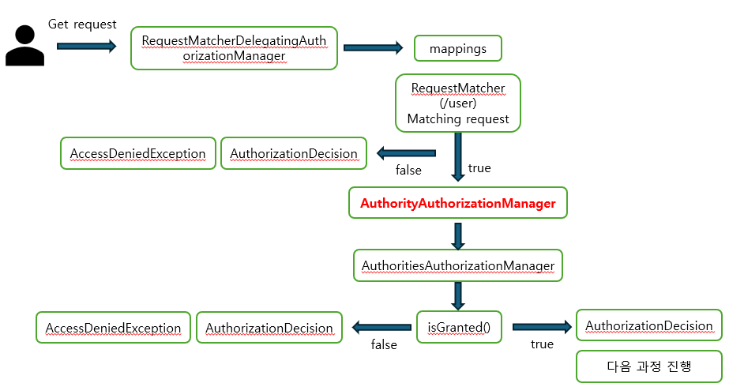
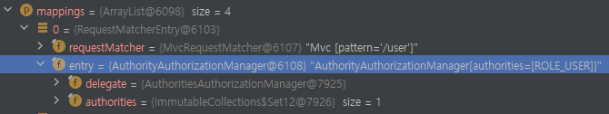

### 인가 구조



- Spring Security에서 Authentication 내부에 GrantedAuthority 클래스를 통해 권한 목록을 관리
- AuthenticationManager 에서 인증을 처리할 때, Authentication 객체에 GrantedAuthority 객체를 저장한다
- 이후 인가(Authorization)처리는 AuthorizationManager 를 통해 Authentication의 GrandtedAuthority 객체를 읽어들여 처리한다


### AuthorizationManager
- 권한 부여 처리는 AuthorizationFilter 에서 시작되며, 해당 필터가 AuthorizationManager 를 호출해서 권한을 부여할지 결정한다
- 메서드는 verify 와 check 를 가진다



check() : 권한을 줘야할지 결정하기 위한 정보들이 전달된다. 예를들어 인증객체, 요청 정보, 권한 정보 등,

또한 액세스가 허용되면 true를 나타내는 AuthorizationDecision, 거부되면 false를 포함하는 AuthorizationDecision가 반환되며
, 결정을 못내리는 경우 null 을 반환

verify() : check를 호출해서 반환된 값이 false를 가진 AuthorizationDecision 인 경우, AccessDeniedException을 throw 해주는 함수

<br>
<br>

### 인가 처리 준비 과정

다음과 같이 경로별 접근 권한을 설정하면, 어떤 과정이 발생하는지 보자

```java
	@Bean
	SecurityFilterChain filterChain1(HttpSecurity http, ApplicationContext context) throws Exception {
		http
			.authorizeHttpRequests(auth -> auth
				.requestMatchers("/user").hasRole("USER")
				.requestMatchers("/db").access(new WebExpressionAuthorizationManager("hasRole('DB)"))
				.requestMatchers("/admin").hasRole("ADMIN")
				.anyRequest().authenticated())
			.formLogin(Customizer.withDefaults())
			.csrf(AbstractHttpConfigurer::disable);

		return http.build();
	}
```

- "/user" 는 USER 만 접근할 수 있고
- "/db" 는 WebExpressionAuthorizationManager 를 사용하여 DB 권한 있는 사용자만 접근 가능하고
- "/admin" 은 ADMIN 만 접근 가능하다 

그럼 RequestMatcherDelegatingAuthorizationManager 에서 요청 주소와 권한을 보고, 

요청 주소를 담고 있는 Matcher 와 권한 처리를 담당하는 Manager를 생성하여 리스트에 추가 한다 



- .requestMatchers("/user").hasRole("USER") 부분을 예로들면
- requestMatchers("/user") 을 보고 requestMatcher에 "/user" 가 저장되고
- hasRole("USER") 을 사용했기 때문에 AuthorityAuthorizetionManager 가 지정된 것이다.


> 그럼 사용자가 "/user" 로 요청을 했을 때, "/user"를 처리하는 Matcher 를 찾고,
Manager 를 가져와서 권한 처리를 시작하는데, 여기서는 AuthorityAuthorizetionManager 가 사용되는 것이다.

<br>

### 인가 처리 진행 과정

유저가 접근 가능한 리소스에 접근할 경우 



- 또한 실질적인 권한 처리는 AuthorityAuthorizationManager 가 아닌 
- AuthoritiesAuthorizationManager 가 위임받아 처리를 하게되며
- 그래서 다음과 같이 delegate 를 포함하고 있다

